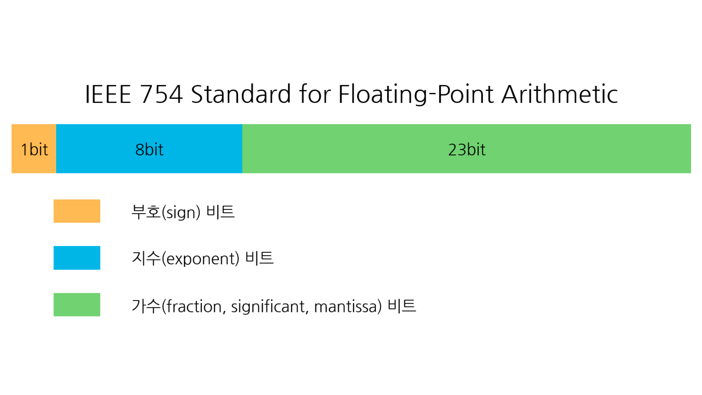

## 02-2 데이터 형식 
pg.47, chapter 02 변수와 연산자

- 다양한 데이터 형식들의 체계를 이해하고 차이점 구분하기
- 용도에 맞는 적절한 데이터 형식을 선택해 활용하기

### `변수`의 정의: 
프로그래밍에서 말하는 변수란 
'값을 저장할 수 있는 공간'입니다.
C++ 언어에서는 `변수에 값을 저장하기 전에` 
정수, 부동 소수점 수, 문자 등 
`어떤 값을 저장할지 미리 정해주어야` 합니다.
이를 **`데이터 형식(data type)`** 이라고 합니다. 
데이터 형식은 프로그래밍에서 가장 기본적인 요소입니다.

### 변수 형식 결정
- 파이썬 같은 `인터프리터 언어`는 `변수의 형식을 자동으로 결정`해 줍니다.
- 반면에 C, C++ 같은 컴파일 언어는 형식을 직접 지정해 주어야 합니다.
형식이 엄격한 언어는 변수를 선언하고 사용할 때 
어떤 형식으로 만들지 항상 고민해야 합니다. 
파이썬처럼 형식이 유연한 언어보다 훨씬 까다롭지만,
런타임 오류도 줄고 메모리를 효율적으로 이용할 수 있다는 장점이 있습니다. 

### C++ 데이터 형식 분류
- `C++` 언어의 데이터 형식은 크게 5가지로 분류할 수 있습니다.
형식 (키워드) / 크기(byte) / 특징

1. **보이드(void)**: 크기 none. Void는 "형식 없음"을 의미함
2. **불리언(bool)**: 크기 1bit. true, false 표현.
3. **문자**:  
    - `char`: 1. 8비트 정수형으로 사용될 경우, 일반적으로 `-128 ~ 127`. C++ 언어 표준에서는 적어도 `-127 ~ 127` 범위 지정.
    - `unsigned char`: 1. `0~255`
    - `signed char`: 1. 부호 비트를 가지도록하는 명시적 표현
    - 그 외: char8_t (1 bit), char16_t (2 bites), char32_t (4 bites), wchar_t (2 bites), __wchar_t (2 bites)

4. **정수**:
    - `short`(2 bytes): 적어도 char보다는 크기가 큰 정수 형식
    - `unsigned short` (2 bytes): 양수만 저장
    - `int` (4 bytes): 일반적으로 가장 많이 사용하는 정수 형식
    - `unsigned int` (4 bytes): 양수만 저장
    - 그 외 #1: __int8(1 bit), __int16 (2 bytes), __int32 (4 bytes), __int64 (8 bytes)
    - `long` (4 bytes): long의 경우 32비트 운영체제에서는 4byte(32 bit), 64비트 운영체제에서는 8byte(64bit)인데, 윈도우 64bit에서는 long도 4byte로 취급
    - `unsigned long` (4 bytes): 양수만 저장
    - `long long` (8 bytes): int 형 연산에서 초과되는 범위를 다룰 때 사용. 적어도 8byte 이상 크기 보장(C++11 이후)
    - `unsigned long long` (8 bytes): 양수만 저장

5. **부동 소수점**
    - `float` (4 bytes): C++ 언어에서 가장 작은 부동 소수점 형식
    - `double` (8 bytes): float보다 큰 부동 소수점 형식. 소수를 구해야 하는 연산에서는 `double`이 소수점 아래 표현을 더 많이 할 수 있으니 `double`을 추천
    - `long double` (8 bytes): GCC, G++ 에서는 `long double`이 16byte

### `__int8`, `__wchar_t` 같은 자료 형식은 무엇인가요?
- 데이터 형식 앞에 `__`이 붙은 것은 마이크로소프트에서 제공하는 확장형입니다.
- C++ 표준은 아니며, 마이크로소포트 비주얼 C++ 컴파일러에서만 인식합니다.
- 이러한 마이크로소프트 확장형은 특정 환경에서만 지원되며, 호환성이 떨어질 수 있습니다. 
이를 대체하는 `int8_t`, `wchar_t` 같은 표준 C++ 자료형을 사용하는 것이 좋습니다.

### 형식이 없음을 나타내는 void
C++ 에서 `void`는 형식이 없음을 나타냅니다. 따라서 `void`형으로는 다음처럼 `변수를 선언할 수 없습니다.`

```cpp
void value;
```

그럼 `void`형은 언제 사용할까요? `void`형은 3가지 상황에서 사용합니다.
```
1. 함수가 값을 반환하지 않음을 표시할 때
2. 함수의 매개변수가 없음을 표시할 때
3. 어떤 변수라도 가리킬 수 있는 제네릭 포인터 generic pointer를 만들 때 
```

1. **함수가 값을 반환하지 않음을 표시할 때**
- 다음 코드에서 `print_func` 함수에는 값을 반환하는 `return`문이 없습니다. 
이처럼 반환값이 없는 함수를 선언할 때 `void`를 사용합니다. 
```cpp
void print_func()
{
   std::cout << "func" << std::endl;
}
```

2. **함수의 매개변수가 없음을 표시할 때**
- 물론 함수의 매개변수가 없으면 아무것도 입력하지 않은 채 ()처럼 빈 괄호로 두어도 됩니다.
- 하지만 다음 코드처럼 `void`로 표시하면 매개변수가 없음을 `명시적`으로 나타낼 수 있습니다.
```cpp
int input_func(void)
{
   int input_value;
   std::cin >> input_value;
   return input_value;
}
```

3. **어떤 변수라도 가리킬 수 있는 제네릭 포인터 generic pointer 를 만들 때 사용**
- 제네릭 포인터에서 `void`는 단순히 '형태가 없음'을 의미하기보다 '형태가 자유로움'을 의미한다고 이해하는 편이 좋습니다.

```cpp
int int_value;
float float_value;
void *ptr_value;
ptr_value = &int_value;
ptr_value = &float_value;
```
### 참, 거짓만 가지는 bool 형식
- `bool`은 `참(true: 1)`과 `거짓(false: 0)`만 가질 수 있는 형식입니다.
- `bool`형 변수에 `true` 나 `false` 값을 초기화하거나 할당할 수 있지만,
`실제로는 키워드가 아닌 정수로 저장`됩니다. 
- `true`는 1, `false`는 정수 0을 의미합니다.

bool 형 변숫값 출력하기
```cpp
#include <iostream>
using namespace std;

int main()
{
   bool value;
   
   value = true;
   cout << value << endl;
   
   value = false;
   cout << value << endl;
   
   return 0;
}
```

실행 결과
```python
1
0
```

### 문자 형식
- `char`는 C, C++ 언어에서 문자를 다룰 때 사용하는 대표적인 데이터 형식입니다.
하지만 사실 `char`는 `8bit(=1byte) 정수를 저장하는 역할을 할 뿐, 문자 전용 데이터 형식은 아닙니다.` 
`char`에 저장된 값은 아스키 ASCII 코드로 변환하여 사용할 수 있습니다.

- 아스키 코드 표를 보면 문자로 출력할 수 있는 것은 32~126번까지 입니다.
- 해당 범위를 콘솔에 출력해 보면 다음과 같습니다.

아스키 코드 출력하기
```cpp
#include <iostream>
using namespace std;

int main() {
    cout << "아스키 코드 출력하기 [32 ~ 126]:\n";
    for (char i = 32; i<= 126; i++) // 32부터 126까지 1씩 증가하며 반복
        {
        // 아스키 코드를 출력할 때, 공백을 넣고 16개마다 줄 바꾸기
        cout << i << ((i % 16 == 15)? '\n' : ' ');
        }
    return 0;
}
```

실행 결과
```cpp
아스키 코드 출력하기 [32 ~ 126]:
  ! " # $ % & ' ( ) * + , - . /
0 1 2 3 4 5 6 7 8 9 : ; < = > ?
@ A B C D E F G H I J K L M N O
P Q R S T U V W X Y Z [ \ ] ^ _
` a b c d e f g h i j k l m n o
p q r s t u v w x y z { | } ~
```

문자를 표현하는 데 `char`를 사용하는 이유는 아스키 코드가 7bit 형태의 체계를 따르고 있어서입니다.
나머지 1bit는 통신 확인용 패리티parity 비트입니다.
즉, `char`가 아스키 문자를 저장할 때는 0~127 사이의 값을 가집니다.

만약 `char`를 8bit 정수 저장용으로 사용한다면 1bit를 부호로 사용하며 -128~127을 저장하지만,
`unsigned` 키워드를 사용하면 부호 비트까지 활용하여 0~255까지 더 많은 양수를 저장할 수 있습니다.

추가 설명 by chatGPT: 
### ✅ C++에서 `char`를 사용하는 이유와 동작 방식

### 1. 왜 문자를 `char`로 표현할까?

> **"문자를 표현하는 데 `char`를 사용하는 이유는 아스키 코드가 7bit 형태의 체계를 따르고 있어서입니다."**

- 아스키(ASCII) 코드는 알파벳, 숫자, 기호 등을 **0~127**의 정수로 표현하는 문자 인코딩 방식입니다.
- 총 128개의 문자만 필요하므로 `7비트(bit)`면 충분합니다.
- C 및 C++에서는 이 값을 저장하기 위해 **8비트(1바이트)** 크기의 `char` 자료형을 사용합니다.

---

### 2. 나머지 1비트는 뭐지?

> **"나머지 1bit는 통신 확인용 패리티(parity) 비트입니다."**

- 통신 시스템에서는 7비트 데이터 외에 1비트를 **오류 검출용 패리티 비트**로 쓰기도 했습니다.
- 하지만 C++에서의 `char`는 **8비트를 모두 데이터 저장용으로 사용**합니다.  
  패리티 비트는 **하드웨어 및 통신 프로토콜에서나 의미 있는 개념**입니다.

---

### 3. `char`가 아스키 문자를 저장할 때

> **"`char`가 아스키 문자를 저장할 때는 0~127 사이의 값을 가집니다."**

- 문자를 저장할 때는 `'A' → 65`, `'z' → 122` 등 아스키 값으로 저장됩니다.
- `char`는 내부적으로 숫자값을 기반으로 처리되며, 0~127 범위를 사용합니다.

---

### 4. 정수 저장용으로 쓸 경우

> **"만약 `char`를 8bit 정수 저장용으로 사용한다면 1bit를 부호로 사용하며 -128~127을 저장하지만,"**

- `char`는 본질적으로 8비트 자료형입니다.
- `signed char`는 -128 ~ 127 범위의 값을 저장할 수 있습니다.
- 가장 왼쪽 1비트는 부호를 나타내며 `0 → 양수`, `1 → 음수`를 의미합니다.

---

### 5. `unsigned char`는 어떤가요?

> **"`unsigned` 키워드를 사용하면 부호 비트까지 활용하여 0~255까지 더 많은 양수를 저장할 수 있습니다."**

- **`unsigned char`**는 모든 8비트를 데이터로 활용하며, **0 ~ 255** 범위를 다룹니다.
- 음수는 표현할 수 없지만, 더 넓은 양수 범위를 커버할 수 있어  
  **이미지 처리, 바이너리 파일 조작 등에서 자주 사용됩니다.**

---

### 🔎 요약 표

| 타입             | 비트 수 | 값 범위         | 주요 용도                       |
|------------------|--------|------------------|----------------------------------|
| `char` (보통)     | 8bit   | -128 ~ 127 또는 0 ~ 255 | 문자 저장, 일반 바이트 처리     |
| `signed char`    | 8bit   | -128 ~ 127       | 부호 있는 정수 저장              |
| `unsigned char`  | 8bit   | 0 ~ 255          | 부호 없는 정수, 이진 데이터 처리 |


## char, wchar_t, 유니코드 등
`wchar_t`는 와이드 문자 wide characters를 저장하는 자료형입니다.
비주얼 스튜디오에서는 `wchar_t`를 2byte로 정의하고,
GCC 컴파일러는 4byte로 정의합니다. 
하지만 GCC에서도 컴파일할 때 `-fshort-wchar` 옵션을 적용하면
`wchar_t`를 2byte로 사용할 수 있습니다.
`wchar_t`와 `char`의 차이를 비교하면 다음 표처럼 정리할 수 있습니다.

### 🔍 `char` vs `wchar_t` 비교

| 항목             | `char`                                                  | `wchar_t`                                               |
|------------------|----------------------------------------------------------|----------------------------------------------------------|
| **인코딩 방식**   | 멀티바이트 문자 인코딩 (MBCS), ASCII, UTF-8 등           | 유니코드 (UTF-16 또는 UTF-32 기반, 컴파일러에 따라 다름) |
| **단일 문자 크기** | 1바이트 (8비트) — 영문자, 숫자 등<br>2바이트 — 일부 한글, 한자 등 | 보통 2바이트 (Visual Studio)<br>보통 4바이트 (GCC 기본 설정) |
| **표현 범위**     | ASCII 문자 및 가변 길이 유니코드 문자                    | 고정 길이 유니코드 문자 표현 (BMP 또는 전체 유니코드 영역) |
| **문자열 예시**   | ANSI 문자열, UTF-8 문자열<br>`std::string`               | 와이드 문자열 (UTF-16)<br>`std::wstring`                 |


### ✨ 부연 설명 — 도대체 위 표가 무엇을 말하는 걸까요? (출처: chatGPT)

C++에서 문자를 저장할 때 `char`나 `wchar_t`를 사용하는 이유는  
**‘문자를 표현하는 방식’과 ‘저장 크기’가 서로 다르기 때문**입니다.

---

### 🔸 `char`는 "좁은 문자" — 영어 중심, 가볍고 널리 쓰임
- `char`는 **영어와 숫자**처럼 간단한 문자를 표현하는 데 적합한 자료형입니다.
- 크기는 **1바이트(8비트)**이며, **ASCII 또는 UTF-8** 인코딩에서 주로 사용됩니다.
- 예: `'A'` → 65, `'a'` → 97 (ASCII 값)
- 한글이나 한자는 표현 가능하지만, **UTF-8에선 여러 바이트로 나뉘어 저장**됩니다.

---

### 🔸 `wchar_t`는 "넓은 문자" — 전 세계 언어 지원
- `wchar_t`는 "wide character"를 의미하며, **더 넓은 문자 범위(유니코드)**를 표현할 수 있습니다.
- 크기는 구현에 따라 다르며:
  - **Windows (MSVC)**: 2바이트 (UTF-16 기반)
  - **Linux (GCC)**: 4바이트 (UTF-32 기반)
- 한글, 한자, 이모지, 아랍어, 태국어 등 **다국어 문자**를 하나의 `wchar_t`로 표현할 수 있습니다.

---

### 🔸 인코딩 방식 차이 — 가변 길이 vs 고정 길이
- `char` + UTF-8: **가변 길이 인코딩**  
  → 문자에 따라 1~4바이트까지 차이남.
- `wchar_t` + UTF-16 또는 UTF-32: **(거의) 고정 길이 인코딩**  
  → 대부분 문자가 2바이트(UTF-16) 또는 4바이트(UTF-32)로 표현됨.

---

### 🔸 문자열 사용 예시

| 표현 방식         | 문자열 예시                | 사용 타입            |
|------------------|----------------------------|----------------------|
| 일반 문자열       | `"hello"`                  | `std::string`, `char` |
| 와이드 문자열     | `L"안녕하세요"`             | `std::wstring`, `wchar_t` |

---

### ✅ 요약 비유

| 상황                            | 사용하는 타입       |
|----------------------------------|----------------------|
| 영어, 숫자, 간단한 데이터        | `char`               |
| 한글, 중국어 등 다국어 문자       | `wchar_t`            |
| 국제화 대응, UTF-8 기반 시스템    | `char` + UTF-8       |
| Windows API 유니코드 지원        | `wchar_t`            |


💡 *현대 C++에서는 `char16_t`, `char32_t`, `u8""`, `u""`, `U""` 등의 타입과 문자열 리터럴을 통해 더 명확한 유니코드 지원이 가능합니다.* (C++11 이후)
`End of chatGPT`
---
다시, 교재로 돌아가서,
외국어로 인사말 출력하기를 구현해 봅시다.
```cpp
#include <iostream>
#include <io.h>     // _setmode
#include <fcntl.h>  // _O_U16TEXT
using namespace std;

int main() {
    // 한글 와이드 문자열 선언
    wchar_t message_korean[] = L"반갑다 세계야!";

    // 콘솔 출력 모드를 유니코드(UTF-16)로 설정
    _setmode(_fileno(stdout), _O_U16TEXT);

    // 와이드 문자열 출력
    wcout << message_korean << endl;

    return 0;
}
```
실행 결과
```python
반갑다 세계야!
```

## 정수 형식 (integer type)
- 일반적으로 가장 많이 사용하는 데이터 형식을 꼽으라면 단연코 정수형이 그 주인공입니다.
- 프로그래밍에서 정수형 데이터는 `수학에서 정의하는 정수의 개념과 같습니다`.
- 정수란, `영의 정수(1,2,3,4,5,...), 음의 정수(-1,-2,-3,-4,...) 그리고 0`으로 이루어진 수 체계입니다.

### 정수형 자료 형식의 특징
- 정수형은 `다른 데이터 형식과 달리 조금 특이하게 설정`되어 있습니다.
- 정수형의 기준이 되는 `int`는 `시스템의 자연스러운 크기를 따르도록 규정`하고 있습니다.
- 따라서 `int`는 `컴퓨터 시스템에 따라 크기가 다릅니다`. 예를 들어 16bit 시스템에서 `int`는 16bit이고, 32bit 시스템에서는 32bit입니다.
- 그런데 현재 컴퓨터 시장에서 거의 기본으로 출시되는 64bit 시스템에서 int는 64bit일 것 같지만, 실제로는 32bit(=4byte)입니다.

정수형 크기 출력하기
```cpp
#include <iostream>
using namespace std;
int main()
{
    cout << "short : " << sizeof(short) << " bytes" << endl;
    cout << "unsigned short : " << sizeof(unsigned short) << " bytes" << endl;
    cout << "int : " << sizeof(int) << " bytes" << endl;
    cout << "unsigned int : " << sizeof(unsigned int) << " bytes" << endl;
    cout << "long : " << sizeof(long) << " bytes" << endl;
    cout << "unsigned long : " << sizeof(unsigned long) << " bytes" << endl;
    cout << "long long : " << sizeof(long long) << " bytes" << endl;
    cout << "unsigned long long : " << sizeof(unsigned long long) << " bytes" << endl;
    
    return 0;
}
```

실행 결과
```cpp
short : 2 bytes
unsigned short : 2 bytes
int : 4 bytes
unsigned int : 4 bytes
long : 4 bytes
unsigned long : 4 bytes
long long : 8 bytes
unsigned long long : 8 bytes 
```

- 예시는 64bit 윈도우에서 실행한 결과입니다. `int`의 크기가 4 byte (=32 bit)로 출력됩니다.
실행하는 시스템에 따라 크기는 다르게 나올 수 있습니다.

- 앞서 언급한 대로 C++ 언어 표준안은 정수형의 크기를 정확하게 명시하지 않지만,
최소한으로 정의된 것을 요약하면 다음과 같습니다.

```
1 byte == sizeof(char) <= sizeof(short) <= sizeof(int) <= sizeof(long) <= sizeof(long long)
```

- 정수형에서 `signed, unsigned` 문자형에서 설명한 것과 같습니다.
부호가 있는(`signed`) 정수는 음사와 양수를 모두 저장할 수 있습니다.

- `signed` 키워드를 이용해 부호가 있는(`signed`) 정수는 음수와 양수를 모두 저장할 수 있습니다. 
- 반대로 부호가 없는(`unsigned`) 정수는 양수만 가질 수 있습니다. `unsigned` 키워드를 이용해 부호 없는 정수를 명시적으로 선언할 수 있습니다.

## 🔢 `signed` vs `unsigned` 정수 표현 범위 비교

| 크기 (byte) | 타입             | 표현 범위                                      |
|-------------|------------------|------------------------------------------------|
| 1바이트     | `signed`         | -128 ~ 127                                     |
|             | `unsigned`       | 0 ~ 255                                        |
| 2바이트     | `signed`         | -32,768 ~ 32,767                               |
|             | `unsigned`       | 0 ~ 65,535                                     |
| 4바이트     | `signed`         | -2,147,483,648 ~ 2,147,483,647                 |
|             | `unsigned`       | 0 ~ 4,294,967,295                              |
| 8바이트     | `signed`         | -9,223,372,036,854,775,808 ~ 9,223,372,036,854,775,807 |
|             | `unsigned`       | 0 ~ 18,446,744,073,709,551,615                 |

### ✅ 참고 사항 (출처: chatGPT)

- `signed` 정수는 **부호 있는 표현**이며, 전체 비트 중 **1비트를 부호(+, -)** 표시용으로 사용합니다.
- `unsigned` 정수는 **양의 정수 전용**이며, **모든 비트를 값 표현에 사용**하므로 더 넓은 양의 범위를 가질 수 있습니다.
- 자료형의 크기는 플랫폼 및 컴파일러에 따라 다르지만, 일반적으로 다음과 같은 대응 관계를 가집니다:

#### 📦 정수형 타입과 일반적인 크기

| 타입        | 일반적인 크기 (byte) |
|-------------|----------------------|
| `char`      | 1                    |
| `short`     | 2                    |
| `int`       | 4                    |
| `long`      | 4 또는 8             |
| `long long` | 8                    |

## float (부동 소수점) 형식
- `부동`이란, "떠다니며 움직인다"라는 의미입니다.
- 즉, 소수점이 고정되지 않고 움직인다는 뜻입니다.
- 소수점이 움직인다는 것은 정수부와 소수부의 자릿수가 일정하지 않다는 의미입니다.
- 그렇지만 `유효 숫자의 자릿수는 정해져 있습니다.`
- 즉, 자료형의 크기가 정해져 있으므로, 부동 소수점의 특정 자리까지만 저장할 수 있고 나머지는 유실됩니다.
- 부동 소수점의 `정밀도 floating point precision`는 데이터 유실 없이 
얼마나 많은 유효 자릿수를 나타낼 수 있는지를 말합니다. 정밀도 관련 코드를 살펴보고
설명을 이어가겠습니다.

**부동 소수점 출력하기**
 ```cpp
// pg. 56: 부동 소수점 출력하기
#include <iostream>
using namespace std;

int main() {
    cout << 0.97654321f << endl;
    cout << 987654.321f << endl;
    cout << 9876543.21f << endl;
    cout << 0.00000987654321f << endl;
    cout << 0.00000000000987654321f << endl;

    return 0;
}
 ```

실행 결과
```cpp
0.976543
987654
9.87654e+06
9.87654e-06
9.87654e-12
```
- 실행 결과를 보면 유효한 숫자 표현으로 6자리만 출력된 것을 확인할 수 있습니다.
- `cout`은 부동 소수점을 출력할 때 기분 정밀도가 6으로 설정되어 있습니다.
- 따라서 6자리까지만 유효하다고 가정하고 나머지는 생략합니다.

**IEEE 754 부동 소수점 표준**

- C++ 언어의 부동 수수점은 IEEE 754에서 정의한 형식으로 정의되어 있습니다.
- IEEE 754는 전기전자기술자협회(IEEE)에서 개발한 표준으로,
컴퓨터에서 부동 소수점을 표현하는 데 가장 널리 쓰입니다.
- IEEE 754의 부동 소수점 표현은 크게 세 부분으로 구성됩니다.
```
1. 최상위 비트는 부호를 표시하는 데 사용하며
2. 지수(exponent)
3. 가수(fraction/mantissa) 
```
부분으로 나뉩니다.

- 부동 소수점 방식은 컴퓨터에서는 고정 수서점 방식보다 `넓은 범위의 수를 나타낼 수 있어 계산에 많이 이용`되지만,
- 근삿값으로 표현되고 고정 소수점 방식보다 `연산 속도가 느려 별도의 전용 연산 장치를 두는 경우가 많습니다`. 
- 부동 소수점을 계산하는 데 최적화된 장치로 그래픽 카드가 있습니다.

C++ 언어에서 지원하는 부동 소수점 형식을 사용한 예를 보겠습니다.
참고로 코드에서 부동 소수점을 표현할 때 숫자 뒤에 
- `f`를 붙이면 `float`형,
- `l`을 붙이면 `long double`형
- 아무것도 붙이지 않으면 `double`형 값이 됩니다.

부동 소수점의 최대 요휴 자릿수만큼 출력하기
```cpp
// pg.57: 부동 소수점의 최대 유효 자릿수만큼 출력하기
#include <iostream>
#include <iomanip>
#include <limits>
using namespace std;

int main() {
    float float_value = 9.87654321f;
    double double_value = 9.87654321987654321;
    long double long_double_value = 9.87654321987654321l;

    cout << "float: " << sizeof(float) << " bytes" << endl;
    // 유효 자릿수만큼 정밀도 조정
    cout << "float_value: " << setprecision(numeric_limits<float>::digits10 + 1) << float_value << endl << endl;

    cout << "double: " << sizeof(double) << " bytes" << endl;
    cout << "double_value: " << setprecision(numeric_limits<double>::digits10 + 1) << double_value << endl << endl;

    cout << "long_double: " << sizeof(long double) << " bytes" << endl;
    cout << "long_double_value: " << setprecision(numeric_limits<long double>::digits10 + 1) << long_double_value << endl << endl;

    return 0;
}
```

```cpp
float: 4 bytes
float_value: 9.876543

double: 8 bytes
double_value: 9.876543219876543

long_double: 16 bytes
long_double_value: 9.87654321987654321
```

- 이 코드에서 사용한 `std::setprecision`은 `cout`에서 
출력되는 기본 정밀도를 조절하는 함수입니다.
즉: `std::setprecision(std::numeric_limit<데이터_형식>>::digits10 + 1);`
코드는 특정 데이터 형식이 표현할 수 있는 유효 자릿수만큼 정밀도를 조절하겠다는 의미입니다.

- 출력 결과를 살펴보면 부동 소수점 형식마다 크기와 출력된 자릿수가 다른 것을 확인할 수 있습니다.
부동 소수점의 크기에 따른 표현 범위와 유효 자릿수를 정리하면 다음과 같습니다.

## 🧮 부동 소수점(Floating-Point)의 크기별 표현 범위 및 유효 자릿수
부동 소수점 숫자는 크기에 따라 표현할 수 있는 값의 범위와 정밀도(유효 자릿수)가 달라집니다. 일반적으로 C++에서는 IEEE 754 표준에 따라 다음과 같이 정의됩니다:

| 크기 (바이트) | 자료형 (`float`, `double` 등) | 표현 범위                                          | 유효 자릿수 (소수점 기준)        |
|---------------|-------------------------------|-----------------------------------------------------|----------------------------------|
| 4             | `float`                       | ±1.18 × 10⁻³⁸ ~ ±3.4 × 10³⁸                         | 약 6 ~ 9자리 (일반적으로 7자리)  |
| 8             | `double`                      | ±2.23 × 10⁻³⁰⁸ ~ ±1.80 × 10³⁰⁸                      | 약 15 ~ 18자리 (일반적으로 16자리) |
| 16            | `long double` (플랫폼 종속)   | ±3.36 × 10⁻⁴⁹³² ~ ±1.18 × 10⁴⁹³² *(x86 기준)*       | 약 33 ~ 36자리 *(환경에 따라 상이)* |

## 데이터 형식
- `정수형(integer)`: 정수를 표현하는 형식으로 int, short, long, long long 등이 있다.
각 형식은 `저장하는 비트 수에 따라 값의 범위가 다르다`.
- `부동 소수점(floating-point)`: 소수점이 있는 값을 표현하는 형식으로 float, double,
long double 등이 있다. float보다 double이 높은 정밀도를 제공한다.
- `문자 (character)`: 단일 문자를 표현하는 형식으로 char를 사용하며
작은따옴표로 문자를 감싸 표현한다.
- `불리언 (boolean)`: 참(true) 또는 거짓(false)을 표현하는 형식으로 bool을 사용하며,
조건문과 논리 연산에서 주로 활용한다.
- `보이드 (void)`: 함수가 어떤 값을 반환하지 않음을 나타내며, 주로 함수의 반환 타입으로 사용한다.

예시:
```cpp
void func_name() { ... }
int int_age = 25;
bool is_passed = true;
char ch_grade = 'A';
float float_height = 175.5f;
double double_height = 175.5;
long double long_double_height = 175.5l;
```

### 3분 퀴즈
질문: C++ 언어의 데이터 형식을 5가지를 분류해 보세요.

답변: 1. void, 2. bool, 3. 문자, 4. 정수, 5. 부동 소수점

질문: 양수만 저장할 수 있는 `int` 형식의 변수를 선언해 보세요.
답변: unsigned int value;


    


