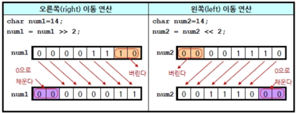
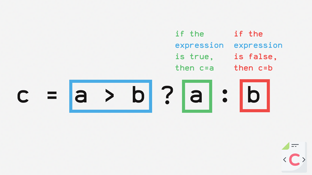

# 02-05 표현식과 연산자
- C++ 언어에서 제공하는 다양한 연산자 활용하기
- 연산자 우선순위를 고려해 표현식 작성하기


## 표현식, 연산자, 피연산자 expression, operator, operand
프로그램은 많은 식과 조건이 조합되어 특정 작업을 수행하는 명령 모음입니다.
- 여기서 `식`이란 흔히 수학에서 사용하는 그 `식`으로 봐도 무방합니다
  - 예: 1 + 2 
- 프로그래밍에서 계산할 때 사용하는 식을 `표현식 expression`이라고 합니다.
  - 표현식을 구성하는 요소: `연산자 operator`, `피연산자 operand`
- 표현식은 계산을 수행하는 것이 기본 목적이므로 항상 결과값을 가집니다.
  - 따라서 대부분의 표현식은 여러 개의 피연산자와 연산자로 구성됩니다.
  - `연산자는 연산의 종류를 결정`하며, 
  - `피연산자는 연산에 참여하는 값 또는 식별자`입니다.
  - 예: 피연산자 1,2. 연산자 +. 표현식 1+2 
- 프로그램에서 표현식은 다양하지만, 크게 `상수, 단항 연산자, 이항 연산자, 삼항 연산자` 표현 식으로 구분할 수 있습니다.

## 상수 표현식 (예: 1, 12.345, 'A')
- `상수 표현식 constant expressions`은 `상수로만 이뤄진 단순한 표현식`입니다. 
- 상수란 1, 12.345, 'A' 처럼 수식에서 변하지 않는 값을 의미합니다.

## 단항 연산자 표현식 (예: (type)a)
- `단항 연산자 표현식 unary operator expression`은 **연산자와 피연산자가 일대일로 매칭되는 표현식**입니다.
- 즉, `연산에 참여하는 피연산자가 하나인 표현식`입니다.

단항 연산자 (Unary Operators) 종류

| 연산자 종류       | 사용 예시              | 설명                          |
|-------------------|------------------------|-------------------------------|
| **부호 연산자**   | `+a`, `-a`             | 양수/음수 부호 지정           |
| **증감 연산자**   | `++a`, `--a`, `a++`, `a--` | 전위/후위 증가 또는 감소     |
| **형식 변환 연산자** | `(type)a`               | 형(type) 캐스팅               |
| **크기 연산자**   | `sizeof(a)`            | 객체 또는 타입의 크기 (byte) |
| **논리 NOT 연산자** | `!a`                   | 조건식 반전 (true ↔ false)   |
| **비트 NOT 연산자** | `~a`                   | 비트 반전                     |
| **포인터 연산자** | `*a`                   | 포인터 역참조 (간접 참조)     |
| **주소 연산자**   | `&a`                   | 변수의 주소 반환              |

예제
```cpp
int a = 5;
int* p = &a;

cout << -a;        // 부호 연산자
cout << ++a;       // 전위 증가
cout << sizeof(a); // 크기 연산자
cout << !a;        // 논리 NOT
cout << ~a;        // 비트 NOT
cout << *p;        // 포인터 역참조 
```

## 증감 연산자 (prefix ++a, postfix a++)
- 프로그래밍에서는 `변숫값을 1만큼 증가하거나 감소하는 연산을 자주 사용합니다.`
  - 증가 연산자인 `++`는 피연산자를 1만큼 증가
  - `--`는 1만큼 감소시킵니다.
  - 하지만 변수 앞에 붙는 `전위연산(++a)`과 뒤에 붙는 `후위연산(a++)`은 연산 순서에 차이가 있습니다.

예제: 증가 연산자, 전위/후위 연산 비교하기
```cpp
#include <iostream>
using namespace std;

int main()
{
    int a = 0; // a의 최초 값은 0
    int b = 0; // b의 최초 값은 0
    
    int a_prefix;
    int b_prefix;
    
    a_prefix = ++a; // 전위 연산: a값을 1만큼 증가시킨 후에 a_prefix에 대입
    b_prefix = b++; // 후위 연산: b값을 b_postfix에 대입한 후에 b값을 1만큼 증가
    
    // 내용 확인
    cout << "a = " << a << ", " << "a_prefix = " << a_prefix << endl;
    cout << "b = " << b << ", " << "b_postfix = " << b_postfix << endl;
}
```

실행결과
```cpp
a = 1, a_prefix = 1
b = 1, b_postfix = 0
```
- 결과를 보면 증가 연산인데도 `전위인지 후위인지에 따라 결과가 다르게 나온 것을 확인`할 수 있습니다.
  - 먼저 a 변수 앞에 붙은 전위 연산자는 a 변수가 다른 연산에 이용되기 전에 수행됩니다.
    - `++a`의 결과로 a = a + 1 = 0 + 1 = 1 이 됩니다.
    - 이후, a_prefix = a = 1이 대입됩니다.
    - 결국, a_prefix = 1, a = 1 이 출력됩니다.
  - 반면에 후위 연산자인 b++를 살펴보면, 연산 순서가 다릅니다.
    - b++로 인해 먼저 b_postfix = b = 0가 설정됩니다. 
    - 이후, b = b + 1 = 0 + 1 = 1 이 대입됩니다.
    - 결국, b_postfix = 0, b = 1이 출력됩니다.
  - 요약하면, 전위 연산자를 사용하면 표현식의 나머지 부분이 평가되기 전에 변숫값이 증가합니다.
  - 하지만 후위 연산자를 사용하면 표현식의 나머지 부분이 평가된 후에 변숫값이 증가합니다.
  - 즉, 연산자의 위치에 따라 연산 순서가 달라집니다. 

## 논리 NOT (logical NOT) !
- 논리 NOT 연산자는 `값이나 식별자 앞에 느낌표 !를 붙여서 사용`합니다.
- `true는 false`로,`false는 true`로 반전합니다.
- C, C++ 언어에서 **0은 false, 0외에는 모두 true로 취급합니다.`
  - 즉, 5는 true이며, !5는 0(false)입니다.

## 비트 연산자
- 비트 연산자 `~`는 비트열을 반전하라는 뜻입니다.
- 각 자릿수의 비트값을 반대로 바꿔 1의 보수를 변환합니다.
- 다음 코드를 실행해 보면, `16진수로 표현한 0이 모두 f로 반전`된 것을 확인할 수 있습니다.
- 만약, 0과 1로 이뤄진 2진수를 1의 보수로 반전하면, 0 -> 1, 1 -> 0 으로 반전되므로
  - 0000 0101 -> 1111 1010 이 됩니다

예제: 배트 연산자로 1의 보수 구하기
```cpp
#include <iostream>
using namespace std;

int main()
{
    unsigned int value = 0x0000000; // 0 을 16진수(hex)로 표현한 값
    
    value = ~value; // bit 연산자 ~ 적용
    cout << hex < value << endl;
    
    return 0;
}
```

실행 결과
```cpp
fffffff
```

## 🧮 2의 보수(Two's Complement)란? (chatGPT 개선안)
2의 보수는 **컴퓨터가 음수를 표현하는 대표적인 방법**입니다.  
대부분의 현대 컴퓨터 시스템은 2의 보수 표현을 사용하여 **정수의 부호(sign)**를 처리합니다.

---

### ✅ 2의 보수 구하는 방법

1. **양수의 이진수에서 모든 비트를 반전하여 1의 보수**를 구합니다.
2. **1의 보수에 1을 더하면 2의 보수가 됩니다.**

#### 예시: `+5`의 2의 보수를 구하는 과정
``` +5 (이진수) : 0000 0101
     ↓ 1의 보수  : 1111 1010
     ↓ +1        : 1111 1011 
     → 이것이 -5의 2의 보수 표현
```

#### ⚙️ 특징: **가장 왼쪽 비트(MSB)**는 **부호 비트**로 사용됩니다.
  - `0` → 양수
  - `1` → 음수
- 2의 보수는 0을 **유일하게 한 번만 표현**합니다 (1의 보수는 +0과 -0이 있음).
- 산술 연산이 간단해지고 하드웨어 구현이 쉬워지는 장점이 있습니다.

| 10진수 | 2진수 (8비트) | 1의 보수         | 2의 보수        | 해석된 음수 값 |
|--------|----------------|------------------|------------------|----------------|
| 0      | `0000 0000`     | `1111 1111`       | `0000 0000`       | 0              |
| 1      | `0000 0001`     | `1111 1110`       | `1111 1111`       | -1             |
| 2      | `0000 0010`     | `1111 1101`       | `1111 1110`       | -2             |
| 3      | `0000 0011`     | `1111 1100`       | `1111 1101`       | -3             |
| 4      | `0000 0100`     | `1111 1011`       | `1111 1100`       | -4             |
| 5      | `0000 0101`     | `1111 1010`       | `1111 1011`       | -5             |

### 💬 관련 개념

- **부호 비트(Sign Bit)**: 맨 앞 비트 (MSB)를 통해 양수/음수를 판별합니다.
- **1의 보수(One's Complement)**: 모든 비트를 반전시킨 형태, 2의 보수 계산의 중간 단계로 사용됩니다.
- **2의 보수 시스템의 장점**: 0을 한 번만 표현하며, 가감산 회로를 단순하게 구현할 수 있습니다.

### 🧪 요약
> 2의 보수 = 1의 보수 + 1  
> MSB가 1이면 음수, 0이면 양수로 해석  
> 대부분의 CPU는 **2의 보수 표현**을 사용해 음수를 처리합니다.

### 문법 요약: 단항 연산자
```cpp
int x_value = 5;
int y_value = ++x_value;  #1. 전위 증가: x_value를 1만큼 증가시키고, 이후 y_value에 대입
int z_value = y_value--;  #2. 후위 증가: z_value에 y_value의 값을 대입하고, 이후 y_value를 1만큼 감소
y_value = -x_value;       #3. 부호 반전: 부호를 반전한 값으로 y_value에 대입 

bool flag_value = true;    
bool opposite_value = !flag_value # 1. 논리 NOT: 값 반전(true -> false, false -> true)
int result_num = ~value_num;      # 2. 비트 반전: 각 비트를 반전한 값을 result_num 에 대입, 결괏값 1111 .... 1111 0101 (10진수 -11)
```

## 이항 연산자 표현식
- `이항 연산자 표현식 binary operator expression`은 `피연산자 연산자 피연산자`처럼 
  - 연산에 참여하는 피연산자가 2개인 표현식입니다.
  - 대부분의 **산술 연산자**, **관계 연산자**, **논리 연산자**, **비트 연산자**가 이에 해당합니다.

### 🔢 산술 연산자 (Arithmetic Operators)

| 연산        | 설명        | 예시       |
|-------------|-------------|------------|
| 대입         | 값을 저장    | `a = 10`    |
| 덧셈         | 더하기      | `a + b`     |
| 뺄셈         | 빼기        | `a - b`     |
| 곱셈         | 곱하기      | `a * b`     |
| 나눗셈       | 나누기      | `a / b`     |
| 나머지       | 나머지 연산 | `a % b`     |

---

### ⚖️ 관계 연산자 (Relational Operators)

> 결과는 모두 `true` 또는 `false`입니다.

| 연산           | 설명                | 예시        |
|----------------|---------------------|-------------|
| 같음           | 좌우가 같은지 비교  | `a == b`     |
| 같지 않음      | 다르면 true         | `a != b`     |
| 초과           | 왼쪽이 클 때        | `a > b`      |
| 이상           | 크거나 같을 때      | `a >= b`     |
| 미만           | 오른쪽이 클 때      | `a < b`      |
| 이하           | 작거나 같을 때      | `a <= b`     |

---

### 🔐 논리 연산자 (Logical Operators)

| 연산     | 설명                                      | 예시       |
|--------|-------------------------------------------|----------|
| 논리 AND | 둘 다 `true`일 때만 `true`                | `a && b` |
| 논리 OR  | 둘 중 하나라도 `true`이면 `true`          | `a\|\|b` |

---

### 🧩 비트 연산자 (Bitwise Operators)

| 연산             | 설명                      | 예시       |
|------------------|---------------------------|----------|
| 비트 AND         | 비트 단위 AND              | `a & b`  |
| 비트 OR          | 비트 단위 OR               | `a \| b` |
| 비트 XOR         | 서로 다르면 1              | `a ^ b`  |
| 오른쪽 시프트    | 비트를 오른쪽으로 이동     | `a >> b` |
| 왼쪽 시프트      | 비트를 왼쪽으로 이동       | `a << b` |


- **산술 연산자**는 숫자 계산에,
- **관계 연산자**는 조건 비교에,
- **논리 연산자**는 조건식 조합에,
- **비트 연산자**는 저수준 연산(암호화, 마스크 등)에 자주 사용됩니다.

## 비트 AND 연산(&)
- 비트 연산자 AND(&)는 `첫 번째 피연산자의 각 비트를 두 번째 피연산자의 비트와 비교해, 양쪽 비트가 모두 1일 때만 결과 비트를 1로 설정`합니다. `그 외에는 해당 비트를 0으로 설정`합니다.

비트 AND 연산 진리표 (1비트 기준)

| `a` | `b` | `a & b` |
|:---:|:---:|:--------:|
|  0  |  0  |    0     |
|  0  |  1  |    0     |
|  1  |  0  |    0     |
|  1  |  1  |    1     |

- 비트 AND 연산을 코드로 확인해 보겠습니다. 다음 코드에서 처음 등장한 `bitsect<B>`은 정수를 8비트 이진수로 변환해 출력해 줍니다.
```cpp
#include <iostream>
#include <bitset>
using namespace std;

int main() {
    int a = 13;       // 00001101
    int b = 27;       // 00011011
    int c = a & b;    // 00001001 → 9

    cout << "a = " << bitset<8>(a) << " : " << a << endl;
    cout << "b = " << bitset<8>(b) << " : " << b << endl;
    cout << "c = " << bitset<8>(c) << " : " << c << endl;

    return 0;
}
```

실행 결과
```cpp
a = 00001101 : 13
b = 00011011 : 27
c = 00001001 : 9
```

### 🧩 비트 OR 연산 (`|`)
비트 연산자 `OR (|)`는 **두 피연산자의 각 비트를 비교하여**,  
**하나라도 1이면 결과 비트를 1**로 설정합니다.  
양쪽 모두 0인 경우만 결과 비트가 0이 됩니다.

 `|` 진리표 (1비트 기준)

| `a` | `b` | `a \| b` |
|:---:|:---:|:--------:|
|  0  |  0  |    0     |
|  0  |  1  |    1     |
|  1  |  0  |    1     |
|  1  |  1  |    1     |

비트 OR 연산하기
```cpp
#include <iostream>
#include <bitset>
using namespace std;

int main() {
    int a = 13;       // 00001101
    int b = 27;       // 00011011
    int c = a | b;    // 00011111 → 31

    cout << "a = " << bitset<8>(a) << " : " << a << endl;
    cout << "b = " << bitset<8>(b) << " : " << b << endl;
    cout << "c = " << bitset<8>(c) << " : " << c << endl;

    return 0;
}
```

실행 결과
```cpp
a = 00001101 : 13
b = 00011011 : 27
c = 00011111 : 31
```

## 비트 XOR 연산(^)
- 비트 연산자 `XOR (^)`는 **두 피연산자의 각 비트를 비교**하여,  
- **서로 다른 경우에만 1**을, **같은 경우에는 0**을 결과로 생성합니다.

## ✅ 특징 요약
- `a ^ b`는 **둘 중 하나만 1일 때** 1이 됩니다.
- **양쪽 비트가 같으면 0**, **다르면 1**
- 흔히 **토글(toggle) 연산**이나 **암호화 알고리즘, 마스킹 처리** 등에 사용됩니다.

 `^` 진리표 (1비트 기준)

| `a` | `b` | `a ^ b` |
|:---:|:---:|:-------:|
|  0  |  0  |    0    |
|  0  |  1  |    1    |
|  1  |  0  |    1    |
|  1  |  1  |    0    |

비트 XOR 연산하기
```cpp
#include <iostream>
#include <bitset>
using namespace std;

int main()
{
  int a = 13;                     // 00001101
  int b = 27;                     // 00011011
  int c = a ^ b; // 비트 XOR 연산  // 00010110 → 22
  
  cout << "a = " << bitset<8>(a) << " : " << endl;
  cout << "a = " << bitset<8>(a) << " : " << endl;
  cout << "a = " << bitset<8>(a) << " : " << endl;
  
  return 0;
}
```

실행 결과
```cpp
a = 00001101 : 13
b = 00011011 : 27
c = 00010110 : 22
```
## 논리 시프트 연산(>>, <<)
- **시프트 연산자**는 비트 단위로 값을 왼쪽 또는 오른쪽으로 이동시키는 연산입니다.  
  - 이름 그대로 **`>>`는 오른쪽 시프트**, **`<<`는 왼쪽 시프트**를 의미합니다.
- 시프트 연산은 `변수 >> 이동 비트 수`, `변수 << 이동 비트 수` 형식으로 사용합니다.
- `>>` 는 오른쪽, `<<`는 왼쪽으로 지정한 숫자만큼 비트를 이동시키며 모자라는 비트는 0으로 채웁니다.

각 시프트 연산을 그림으로 표현하면 다음과 같습니다.
예시: 
```
char num1 = 00001110;
num1 = num1 >> 2;
``` 


- **왼쪽에서 2개의 0을 채움, 오른쪽 2비트는 버림**

## 산술 시프트 연산 (>>, <<)
- C++에서 `<<`와 `>>`는 **논리 시프트**와 **산술 시프트** 모두에 사용되지만,  
  - **오른쪽 시프트(`>>`)는 자료형이 `signed`일 때 산술 시프트로 동작**할 수 있습니다.
  

- 산술 시프트 연산과 논리 시프트 연산은 같은 ``<<, >>`` 연산자를 사용합니다.
  - 하지만, 오른쪽 시프트 연산의 동작 방식에 차이가 있습니다.
  

- `signed` 자료형에서 최상위 비트는 부호 비트로 사용되므로, 오른쪽 산술 시프트`>>` 는 모자라는 최상위 비트를 원래 부호 비트 값으로 채웁니다.
  - 만약 산술 시프트에서 원본 데이터의 최상위 비트가 1인 경우, 시프트 후에도 부호 비트인 1을 유지하면 채워집니다.
  - 반대로 최상위 비트가 0이면 0으로 채워집니다.

### ▶️ 오른쪽 시프트 예시 (`>> 1`)
예시 1: 0101 >> 1  
- 연산 이전: 0101
- 연산 과정: 0 → 0101 → 00101 (가장 오른쪽 1은 버린다)
- 연산 결과: 0010
- 설명: 오른쪽으로 1칸 이동, MSB 0으로 채움

예시 2: 1101 >> 1
- 연산 이전: 1101
- 연산 과정: 1 → 1101 → 11101 (가장 오른쪽 1은 버린다)
- 연산 결과: 1110
- 설명: 오른쪽으로 1칸 이동, MSB 1 유지

### ◀️ 왼쪽 시프트 예시 (`<< 1`)
예시 3: 0101 << 1
- 연산 이전: 0101
- 연산 과정: 0101 <- 0: 01010 (가장 왼쪽 0은 버린다)
- 연산 결과: 1010
- 설명: 왼쪽으로 1칸 이동, LSB(최하의 비트) 0으로 채움

### 정리 요약

| 시프트 종류      | 대상 자료형  | MSB 채움 방식    | LSB 채움 방식    |
|------------------|---------------|-------------------|------------------|
| 오른쪽 시프트 `>>` | `unsigned`    | 0으로 채움 (논리) | 비트 밀림         |
| 오른쪽 시프트 `>>` | `signed`      | 부호 비트로 채움 (산술) | 비트 밀림         |
| 왼쪽 시프트 `<<`   | 모두 동일     | 비트 밀림         | 0으로 채움        |

### ◀️◀️ 2비트 왼쪽 시프트 예시 (`<< 2`)
예시 4: 11110010 << 2
- 연산 이전: 11110010
  - 가장 오른쪽에 2비트 00을 넣음 
  - 가장 왼쪽 2비트는 밀려 나감
- 연산 과정: 11 110010 00
- 연산 결과: 11001000
- 설명: 2비트 왼쪽 이동, 오른쪽에 00 두 개 채움, 왼쪽 2비트는 버려짐

```cpp
#include <iostream>
#include <bitset>
using namespace std;

int main() {
    bitset<4> a ("0101");
    bitset<4> a_right_shift_1 = a >> 1;
    cout << a << endl;                // output: 0101
    cout << a_right_shift_1 << endl;  // output: 0010

    bitset<4> b(string("1101"));             // 4비트 이진수 생성
    bitset<4> b_right_shift_1 = b >> 1;      // 오른쪽으로 1칸 시프트
    cout << b << endl;              // 출력: 1101
    cout << b_right_shift_1 << endl; // 출력: 0110

    bitset<4> c ("0101");
    bitset<4> c_left_shift_1 = c << 1;
    cout << c << endl;               // output: 0101
    cout << c_left_shift_1 << endl;  // output: 1010
}
```
## 이항 연산자
### 산술 연산자
- int x_value = 10, y_value = 5;
- int sum_result = x_value `+` y_value
- int difference_result = x_value `-` y_value;
- int product_result = x_value `*` y_value;
- int quotient_result = x_value `/` y_value;
- int remainder_result = x_value `%` y_value;

### 비교 연산자
- int x_value = 10, y_value = 5;
- bool is_equal = x_value `==` y_value;
- bool is_not_equal = x_value `!=` y_value;
- bool is_greater = x_value `>` y_value;
- bool is_less = x_value `<` y_value;
- bool is_greater_or_equal = x_value `>=` y_value;
- bool is_less_or_equal = x_value `<=` y_value;

### 논리 연산자
- bool logical_and_result = (x_value > 0) && (y_value > 0); // AND
- bool logical_and_result = (x_value > 0) || (y_value > 0); // OR

### 비트 연산자
- int a = 12; // 2진 비트값 0000 ... 0000 1100
- int b = 25; // 2진 비트값 0000 ... 0001 1001

- int result_and = a `&` b; // 각 비트 위치에서 a와 b의 해당 비트가 모두 1이면 결과 비트가 1, 그렇지 않으면 0.
- int result_or = a `|` b;  // 각 비트 위치에서 a 또는 b의 해당 비트가 1이면 결과 비트가 1, 둘 다 0이면 결과 비트는 0.
- int result_xor = a `^` b; // 각 비트 위치에서 a 와 b의 해당 비트가 서로 다르면 결과 비트 1, 같으면 0

### 비트 시프트 연산자
- int a = 16; // 2진 비트값 0000 ... 0001 0000
- int result_right_shift = a `>>` 2; // 오른쪽 시프트: a의 모든 비트를 n만큼 오른쪽으로 이동시킴. 왼쪽에 생긴 빈 비트는 부호 비트와 같은 값으로 채움.
- int result_left_shift = b `<<` 2; // a의 모든 비트를 n만큼 왼쪽으로 이동시킴. 오른쪽에 생긴 빈 비트는 0으로 채움.

## 삼항 연산자 표현식: 피연산자가 3개
- 조건식 `?` 참일_때_표현식 `:` 거짓일_때_표현식
- 삼항 연산자는 `if~else` 문처럼 동작합니다.
  - 먼저 조건식의 결과에 따라 분기하는 간단한 예를 보겠습니다.
  - 다음 코드에서 변수 a는 7, b는 5로 초기화했으므로, result 변수에는 a값이 저장됩니다.

if 조건문으로 분기하기
```cpp
#include <iostream>
using namespace std;

int main()
{
  int a = 7;
  int b = 5;
  int result; 
  
  if (a > b)        // a > b 가 true 이면
    result = a;     // result 에 a값을 저장
    
  else              // a > b 가 false 이면
    result = b;     // result 에 b값을 저장
  
  cout << "result = " << result << endl;
  
  return 0; 
}
```

실행 결과
`result = 7`

같은 예를 `if` 문 대신, 삼항 연산자로 바꾸면 다음과 같습니다.
삼항 연산자 활용하기
```cpp
#include <iostream>
using namespace std;

int main()
{
  int a = 7;
  int b = 5;
  int result;
  
  result = a > b ? a : b; // a > b 가 true 면 result = a, a > b 가 false 면 result = b
  
  cout << "result = " << result << endl;
  return 0;
}
```

**실행 결과**
```cpp
result = 7
```

**설명**



```
a > b     ?   a                      : b
^             ^                        ^
{조건식}      {조건식이 true 일 때}      조건식이 false 일 때
```

- 피연산자는 3개 입니다.
  - 첫 번째 피연산자는 `조건식` (e.g. `a>b`)
  - 두번째 피연산자는 `조건식이 true`일 때 적용 `표현식` (e.g. `a`)
  - 세번째 피연산자는 `조건식이 false`일 때 적용 `표현식` (e.g. `b`)

### Note about 삼항 연산자
- 삼항 연산자는 `if` 조건문보다 코드를 간략하게 작성할 수 있습니다.
- 그러나, `무분별하게 사용하면 오히려 가독성이 떨어질 수` 있습니다. 
- 그리고, 한 줄 단위로 디버깅할 때 더 불편할 수도 있습니다.
- 따라서 삼항 연산자는 `코드의 가독성을 해치지 않는 범위`에서 적절하게 사용하는 것이 좋습니다.

### 문법 요약: 삼항 연산자
```cpp
int a = 10;
int b = 20;
int max_value = (a > b) ? a : b; // a와 b 중 큰 값 대입
```

### 연산자 우선순위
- 연산자 우선순위는 연산자를 여러 개 사용할 때, 또는 연산자 위치에 따라 연산 순서를 나타냅니다.
- C++ 언어의 연산자 우선순위를 표로 정리하면 다음과 같습니다.

**🧮 C++ 연산자 우선순위 및 결합 법칙**
- 연산자가 여러 개 등장하는 식에서 **계산 순서를 결정**하는 것이 연산자 우선순위입니다.  
- 또한, 같은 우선순위를 가진 연산자가 연속해서 나올 경우, **결합 방향**(왼→오 or 오→왼)을 따릅니다.

| 우선순위 | 연산자                          | 설명                                                             | 결합 방향 |
|----------|----------------------------------|------------------------------------------------------------------|-----------|
| 1        | `::`                             | 범위 지정 연산자 (스코프)                                         | 왼 → 오   |
| 2        | `a++`, `a--`                     | 후위 증가/감소                                                   | 왼 → 오   |
|          | `type()`, `type{}`              | 명시적 형 변환 (C++11 이상)                                       |           |
|          | `a()`, `a[]`                    | 함수 호출, 배열 접근                                             |           |
|          | `.`, `->`                        | 객체 및 포인터 멤버 접근                                          |           |
| 3        | `++a`, `--a`                     | 전위 증가/감소                                                   | 오 → 왼   |
|          | `+a`, `-a`                       | 단항 +, - (부호 연산자)                                           |           |
|          | `!`, `~`                         | 논리 NOT, 비트 NOT                                               |           |
|          | `(type)`                         | C 스타일 형 변환                                                  |           |
|          | `*a`, `&a`                       | 포인터 역참조, 주소 연산자                                        |           |
|          | `sizeof`                         | 피연산자의 크기 계산                                              |           |
|          | `co_await`                       | 코루틴 대기 (C++20)                                              |           |
|          | `new`, `new[]`                   | 동적 메모리 할당                                                 |           |
|          | `delete`, `delete[]`             | 동적 메모리 해제                                                 |           |
| 4        | `.*`, `->*`                      | 멤버 포인터 연산                                                 | 왼 → 오   |
| 5        | `*`, `/`, `%`                    | 곱셈, 나눗셈, 나머지                                              | 왼 → 오   |
| 6        | `+`, `-`                         | 덧셈, 뺄셈                                                        | 왼 → 오   |
| 7        | `<<`, `>>`                       | 비트 시프트                                                      | 왼 → 오   |
| 8        | `<=>`                            | 3-way 비교 (C++20)                                               | 왼 → 오   |
| 9        | `<`, `<=`, `>`, `>=`             | 관계 비교                                                        | 왼 → 오   |
| 10       | `==`, `!=`                       | 같음 / 다름 비교                                                 | 왼 → 오   |
| 11       | `&`                              | 비트 AND                                                         | 왼 → 오   |
| 12       | `^`                              | 비트 XOR                                                         | 왼 → 오   |
| 13       | `|`                              | 비트 OR                                                          | 왼 → 오   |
| 14       | `&&`                             | 논리 AND                                                         | 왼 → 오   |
| 15       | `||`                             | 논리 OR                                                          | 왼 → 오   |
| 16       | `?:`                             | 삼항 조건 연산자                                                 | 오 → 왼   |
|          | `throw`                          | 예외 발생                                                        |           |
|          | `co_yield`                       | 코루틴 일시 중단 및 값 반환 (C++20)                              |           |
|          | `=`, `+=`, `-=`, `*=`, `/=`, `%=`| 대입 및 복합 대입                                                | 오 → 왼   |
|          | `<<=`, `>>=`, `&=`, `^=`, `|=`   | 시프트 및 비트 복합 대입                                         |           |
| 17       | `,`                              | 쉼표 연산자 (표현식 나열)                                         | 왼 → 오   |
- 우선순위를 보면 수학에서 연산 순위와 같은 것도 있고 프로그래밍을 하다 보면 자연스럽게 익숙해지는 것도 있습니다.
- 모든 순서를 정확하게 알고 있기는 힘듭니다. 우선순위가 헷갈릴 때는 () 괄호로 우선순위를 정하면 됩니다.

```cpp
#include <iostream>
using namespace std;

int main()
{
  int a = 5, b = 2, c = 8;
  
  int result_ 1 = a + b * c;   // 곱셈 먼저 연산(오른쪽으로 결합)
  cout << "Result 1: " << result_1 << endl;
  
  int result_2 = (a+b) *c;     // 괄호로 우선순위 변경
  cout << "Result 2: " << result_2 << endl; 
  
  bool condition = true;
  int result_4 = (condition && a > b) ? a : b; // > 먼저 연산 (왼쪽으로 결합)
  cout << "Result 4: " << result_4 << endl;
  
  return 0;
}
```

실행 결과
```cpp
Result 1: 21
Result 2: 56
Result 3: 21
Result 4: 21
```

### 단원 정리: 3분 퀴즈
- 질문 1: 표현식을 구성하는 2가지 요소는 무엇일까요?
- 답변 1: `피연산자(operand)` 및 `연산자(operator)`

- 질문 2: 다음 코드에서 b와 c의 값을 예측해 보세요
  ```cpp
  a = 10;
  b = ++a;
  c = a++;  
  ```
- 답변 2: 
  - `b = ++ a` -> `1. a = a + 1 = 10 + 1 = 11` 이후 `2. b = a = 11` 
  - `c = a++` -> `1. c = a = 11` 이후 `2. a = a + 1 = 10 + 1 = 11`
- 결론: `b = 11, c = 11`

- 질문 3: 다음 코드에서 b와 c의 값과 해당 값의 비트를 예측해 보세요.
  ```cpp
  a = 6;   // 0000 ... 0000 0110
  b = a >> 2; 
  c = a << 3; 
  ```
  
  ```cpp
  b = a >> 2;
  a = 0000 0110
  >> 2로 인해 왼쪽 00 추가. 나머지 bit들은 왼쪽에서 오른쪽으로 옮김.
  a >> 2 -> 00 0000 01 10
  가장 오른쪽 10은 삭제
  연산 결과: 0000 0001 
  ```
  ```cpp
  c = a << 3;
  a = 0000 0110
  << 3로 인해 오른쪽 000 추가. 나머지 bit들은 오른쪽에서 왼쪽으로 옮김. 
  a << 3 -> 0 0110 000
  가장 왼쪽 비트 3개는 삭제
  연산 결과: 0011 0000
  ```  
  `b = 0000 0001` 
  `c = 0011 0000`


