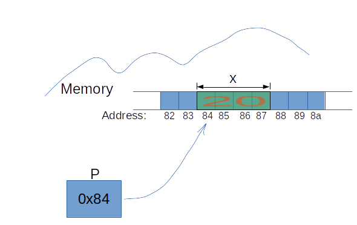

# 03-01: 포인터와 메모리
- `포인터가 왜 필요한지 이해하고 적절하게 활용`하기
- `동적 메모리 할당`을 이용하여 `메모리를 효율적으로 운영`하기

## 변수와 메모리 주소
- 포인터를 제대로 이해하려면 먼저 데이터가 메모리에 저장되는 구조를 알아야 합니다.
- 다음은 `char`, `int`, `double`형 변수를 선언하고 각각의 값으로 초기화한 간단한 코드입니다.

```cpp
#include <iostream>

int main()
{
    char char_value = 14;
    int int_value = 123;
    double double_value = 123.456;
    
    return 0
}
```

- 이 코드를 실행하면 메모리에는 다음 그림과 같은 구조로 데이터가 저장됩니다.
- 메모리는 **연속된 공간**으로 구성되었으며, 각 공간은 **고유한 주소**로 구별됩니다.
- 그리고 프로그램이 동작할 때 연산 장치(CPU)는 `주소를 통해 특정 메모리 공간에 접근`합니다.

char_value(1byte)
- 시작 메모리 주소: 100

int_value(4byte)
- 시작 메모리 주소: 105
- 메모리 주소: 105, 106, 107, 108

double_value(8byte)
- 시작 메모리 주소: 116
- 메모리 주소: 116, 117, 118, 119, 120, 121, 122, 123

         메모리 주소        메모리 내용
        +------------+-------------------+
        | 100        | char_value (14)   |
        | 101~104    | (padding?)        |
        | 105        | int_value byte 1  |
        | 106        | int_value byte 2  |
        | 107        | int_value byte 3  |
        | 108        | int_value byte 4  |
        | 109~115    | (padding?)        |
        | 116        | double_value byte 1
        | 117        | double_value byte 2
        | 118        | ...               |
        | 123        | double_value byte 8
        +------------+-------------------+

일반적으로 64bit 운영체제에서 `char, int, double`형은 각각 1byte, 4byte, 8byte의 크기를 차지합니다.
- `변수를 선언`하면 `자료형의 크기에 맞게 공간을 확보`한 후, `해당 공간에 데이터를 기록`합니다.
  - 확보하는 `실제 공간의 주소 physical address는 메모리 상황에 따라 매번 달라질 수` 있습니다.
  - 즉, 그림에서 `시작 메모리 주소는 프로그램을 실행할 때마다 달라질 수 있다는 의미`입니다.

데이터가 기록된 공간이 어디인지 알 수 있는 시작 메모리 주소는 매우 중요합니다.
- 우리가 친구 집을 찾아가려면 주소가 필요하듯이, `프로그램도 데이터에 접근할 때 시작 메모리 주소로 찾기 때문`입니다.
- 이러한 메모리 주소를 직접 다루는 것은 어렵고 복잡하므로 C++ 언어를 비롯해 대부분 프로그래밍 언어에서는 `변수의 이름을 선언하고 해당 이름으로 데이터에 접근`합니다.

질문: `메모리 주소가 실제 물리적 주소`라고 봐도 되나요?
- 답변: 메모리 주소는 메모리의 물리적 위치에 해당되는 고유 식별자입니다.
  - 하지만, 실제 위치는 런타임 중에 변경될 수 있어요.
  - `프로그램이 실행되는 동안 운영체제가 동적으로 메모리를 할당하거나 해제할 수 있기` 때문에 `변수나 객체의 물리적 위치가 변경될 수 있습니다`.
  - 따라서 메모리 주소는 `실제 위치에 해당하는 가상 주소라고 생각`하면 됩니다. 

## 포인터와 연산자
- 포인터: `메모리 주소를 저장하는 변수`를 의미합니다.
  - 포인터 변수도 일반 변수를 선언할 때처럼 `int`나 `char`와 같은 자료형을 지정합니다.
  - 다만 다음처럼 `자료형과 변수 이름 사이에 별표(*)를 추가`합니다.
  - 포인터 변수 선언: `자료형 *(포인터_변수_이름)`

포인터 변수 선언과 주소 대입하기
```cpp
#include <iostream>

int main() {
    char char_value = 'A';
    int int_value = 123;
    double double_value = 123.456;

    // 포인터 변수 선언: &은 주소를 읽어 오는 주소 연산자
    char *char_pointer_value = &char_value;
    int *int_pointer_value = &int_value;
    double *double_pointer_value = &double_value;

    // 포인터 주소 출력
    std::cout << &char_value << std::endl;
    std::cout << &int_value << std::endl;
    std::cout << &double_value << std::endl;

    return 0;
}
```

- 포인터 변수를 선언하면서 일반 변수로 선언된 `char_value, int_value, double_value`의 `메모리 주소`를 각각의 포인터 변수에 넣었습니다.
- 이때 일반 변수 앞에 붙은 `&`는 피연산자의 주소를 읽어 오는 주소 연산자 입니다.

이 코드를 실행할 때 메모리를 그림으로 표현하면 다음과 같습니다:
- 포인터 변수 `char_pointer_value`: 주소 100, pointing to `char_value (1byte)`
- 포인터 변수 `int_pointer_value`: 주소 105, pointing to `int_value (4byte)`
- 포인터 변수 `double_pointer_value`: 주소 112, pointing to `double_value (8byte)`



- 이 그림은 포인터 변수의 원리를 이해하기 쉽게 개념화한 것입니다.
- 사실 `포인터 변수도 일반 변수처럼 연속되는 메모리상에 8byte` 공간을 차지합니다.
- 예에서 포인터 변수 *char_pointer_value, *int_pointer_value만 실제 메모리의 저장 방식으로 표현될 수 있습니다.

주소     | 내용                        | 비고
---------|-----------------------------|---------------------------
100      | char_value = 'A'            | 1 byte
105      | int_value = 123             | 4 bytes (105 ~ 108)
112      | double_value = 123.456      | 8 bytes (112 ~ 119)
300      | char_pointer_value = 100    | 주소만 저장 (8 byte)
304      | int_pointer_value = 105     | 8 bytes
308      | double_pointer_value = 112  | 8 bytes

## 포인터 변수의 크기
- 포인터 변수의 크기는 `데이터 형식과는 관련이 없습니다`.
  - 따라서 `모든 포인터 변수의 크기는 같습니다`.
- 포인터 변수는 `메모리 주소를 저장하는 데에 사용`되며
  -주소의 크기는 `시스템 아키텍처에 따라 결정`됩니다.
  - 따라서 데이터 형식이나 변수의 크기와는 관계가 없습니다.
  - 그런데도 포인터 변수를 선언할 때 데이터 형식을 지정하는 이유는 `해당 포인터가 가리키는 데이터의 형식을 명시하기 위해서`입니다.
     ```cpp
     int *ptr;     // int형 데이터를 가리키는 포인터
     double *ptr2; // double형 데이터를 가리키는 포인터
    ```
- 이처럼 포인터 선언문에 지정한 데이터 형식으로, `해당 포인터가 가리키는 데이터의 크기와 해석 방법이 결정`됩니다.
  - 이러한 개념은 포인터를 대상으로 연산할 때에 필요합니다.
  - 또한 포인터를 사용하는 코드에서 데이터 형식의 일관성을 유지하고
  - 오류를 방지하는 데에 도움이 되기도 합니다.

## 포인터 변수가 가리키는 데이터에 접근하기
- 포인터 변수에 저장된 주소를 이용해 데이터에 접근하는 방법을 알아보겠습니다.
- 포인터 변수에 역참조 연산자 `*`를 사용하면, `해당 포인터 변수에 저장된 주소가 가리키는 데이터에 접근`할 수 있습니다.

```cpp
#include <iostream>

int main() {
    char char_value = 'A';
    int int_value = 123;
    double double_value = 123.456;

    // 포인터 변수 선언
    char *char_pointer_value = &char_value;
    int *int_pointer_value = &int_value;
    double *double_pointer_value = &double_value;

    // 포인터 주소 출력
    std::cout << std::endl << "address of point variables";
    std::cout << "address of char_value: " << &char_value << std::endl;
    std::cout << "address of int_value: " << &int_value << std::endl;
    std::cout << "address of double_value: " << &double_value << std::endl;

    // 포인터 데이터 출력
    std::cout << std::endl <<  "original data: " << std::endl;
    std::cout << "*char_pointer_value: " << *char_pointer_value << std::endl;
    std::cout << "*int_pointer_value: " << *int_pointer_value << std::endl;
    std::cout << "*double_pointer_value: " << *double_pointer_value << std::endl;

    // 역참조 연산자로 원본 데이터 덮어쓰기
    *char_pointer_value = 'Z';
    *int_pointer_value = 321;
    *double_pointer_value = 654.321;

    // 일반 변수의 데이터 출력(업데이트 확인)
    std::cout << std::endl << "after update: " << std::endl;
    std::cout << "char_value: " << char_value << std::endl;
    std::cout << "int_value: " << int_value << std::endl;
    std::cout << "double_value : " << double_value << std::endl;


    return 0;
}
```

실행 결과
```cpp
address of point variablesaddress of char_value: A↑·┐═z
address of int_value: 0x7acdbffa20
address of double_value: 0x7acdbffa18

original data:
*char_pointer_value: A
*int_pointer_value: 123
*double_pointer_value: 123.456

after update:
char_value: Z
int_value: 321
double_value : 654.321
```
- 실행 결과를 보면 포인터 변수 앞에 `역참조 연산자 *`를 사용해 `포인터 변수가 가리키는 데이터에 직접 접근`하는 것을 확인할 수 있습니다.
- 심지어 *char_pointer_value = 'Z'처럼 새로운 값을 넣으면 char_value 변수의 값이 `Z`로 바뀌는 것도 볼 수 있습니다.

## 다중 포인터
- 포인터가 메모리 주소를 저장하는 `변수`라는 것은 `포인터가 차지하는 공간 역시 주소를 가지고 있음을 의미`합니다.
- 그렇다면 포인터 변수의 주소를 저장하는 또 다른 포인터도 만들 수 있을까요?
- `포인터를 가리키는 포인터 pointer to pointer`를 의미하는 `다중 포인터 multiple pointer`를 이용할 수 있습니다.

예시: 다중 포인터 변수 선언
```cpp
#include <iostream>

int main() {
    /* pg.104 다중 오인터 변수 선언: 시작 */
    int int_value = 123;

    int *int_pt_value = &int_value;
    int **int_pt_value_ptr = &int_pt_value;
    int ***int_pt_value_ptr_ptr = &int_pt_value_ptr;

    std::cout << ***int_pt_value_ptr_ptr << std::endl; // output: 123

    return 0;

    /* pg.104 다중 오인터 변수 선언: 끝 */
}
```
실행 결과: `123`

가정:
- `int_value`의 메모리 주소가 100에서 시작
- `int_pt_value` (pointer to `int_value`) 의 주소가 106에서 시작
- `int_pt_pt_value` (pointer to pointer to `int_value`)의 주소가 117에서 시작
- `int_pt_pt_pt_value` (pointer to pointer to pointer to `int_value`)가 존재

`int_pt_pt_pt_value`에 역참조 연산자 `*`를 적용하면 메모리의 117번지를 찾아갑니다
- 117번지에는 106이라는 주소가 저장돼 있습니다. 
- 117번지에서 한 번 더 `*` 연산자를 적용하면 106이라는 주소가 저장돼 있습니다.
- 106번지에서 한 번 더 `*` 연산자를 적용하면 100이라는 주소가 있습니다. 
- 100번지 주소를 찾아가 비로소 `int_value` 변수에 저장된 정수 123에 접근할 수 있습니다.

즉, 삼중 포인터 변수는 역참조 연산자 `*`를 3번
- 이중 포인터 변수는 2번
- 단일 포인터 변수는 1번 적용해야 값에 접근할 수 있습니다.

## 배열과 포인터
- 포인터를 다루면서 배열과의 관계는 빼놓을 수가 없습니다.
- 먼저 배열이 무엇인지부터 살펴봅시다
  - 예: 로또 추첨 프로그램을 만들기 위해 로또 번호 45개에 해당되는 정수형 변수가 필요
    - 변수를 45개 선언하고 값을 넣으려면 너무 많아서 번거롭습니다.
    - 배열을 이용하여 다음처럼 간단하게 만들 수 있습니다. `자료형 배열_이름[크기n] = {값1, 값2, 값3, ... , 값n};`
  - `배열은 변수가 여러 개 모인 것으로, 같은 자료형의 변수를 연속으로 늘어놓은 형태`입니다.
    - 배열을 선언한 후, `배열_이름[인덱스]`처럼 `[]` 안에 `인덱스index` 라고 하는 차례 번호를 넣으면 해당 순서의 원소에 접근할 수 있습니다.
    - 참고로 배열의 인덱스는 항상 0부터 시작합니다.
      - 예를 들어 배열에서 가장 첫 번째 원소에 접근하려면 인덱스 0을 넣어서 `배열_이름[0]`, 
      - 가장 마지막 원소에 접근하려면 전체 개수(n)보다 하나 작은 인덱스를 지정하며 `배열_이름[n-1]`로 작성하면 됩니다.

## 배열 선언과 원소에 접근하기
- 배열 선언과 원소에 접근하는 코드를 확인해 보겠습니다.

```cpp
int main()
{
    /* pg.106 배열 선언과 원소에 접근하기: 시작 */
    int lotto[10] = {1,2,3,4,5,6,7,8,9,10};
    std::cout << "Today's Lotto numbers: " << lotto[0] << ", " << lotto[3] << ", " << lotto[9] << std::endl;

    /* pg.106 배열 선언과 원소에 접근하기: 끝 */ 
}
```
실행 결과: `Today's Lotto numbers: 1, 4, 10`

- 이 코드에서는 길이가 10인 `고정 배열fixed array`을 선언했습니다.
- 고정 배열은 컴파일 타임의 길이를 알고 있는 배열입니다.
- 잠시 뒤에는 `동적 배열 dynamic array`을 소개할 텐데, 동적 배열의 길이는 런타임에 설정되며 길이를 변경할 수 있습니다.

그림으로 표현하자면,
int lotto[10]의 주소: 100 
- lotto[0]의 주소: 100
- lotto[1]의 주소: 104
- lotto[2]의 주소: 108
- lotto[3]의 주소: 112
- ...

배열의 각 원소를 연속으로 붙어 있습니다. 이는 원소의 메모리 주소를 확인해 보면 더 명확하게 확인할 수 있습니다.
- 주소 연산자 `&`로 출력해 보면, `16진수의 메모리 주소가 4씩 차례로 증가`하는 것을 볼 수 있습니다.
  - 메모리 주소가 4씩 증가하는 것은 `int`형이 `4byte`이기 때문입니다.
  - 그래서 각 원소의 공간을 그림에서 4칸씩 표현할 수 있습니다.

```cpp
    /* pg.107 배열 원소의 메모리 주소 확인하기: 시작 */
    int lotto[10] = {1,2,3,4,5,6,7,8,9,10};

    std::cout << "Today's Lotto numbers: " << lotto[0] << ", " << lotto[3] << ", " << lotto[9] << std::endl;

    std::cout <<"lotto[0] address: " << &lotto[0] << std::endl;
    std::cout <<"lotto[1] address: " << &lotto[1] << std::endl;
    std::cout <<"lotto[2] address: " << &lotto[2] << std::endl;
    std::cout <<"lotto[3] address: " << &lotto[3] << std::endl;


    /* pg.107 배열 원소의 메모리 주소 확인하기: 끝 */
```
실행 결과
```cpp
     lotto[0] address: 0x5fd2bffd60
     lotto[1] address: 0x5fd2bffd64
     lotto[2] address: 0x5fd2bffd68
     lotto[3] address: 0x5fd2bffd6c
```

## 포인터 연산으로 배열의 원소에 접근하기
- 배열의 인덱스로 각 원소에 접근하는 것처럼, `포인터 연산으로도 각 원소에 접근`할 수 있습니다.

```cpp
    /* pg.108: 배열 원소의 주소와 포인터 연산의 결과를 비교하기: 시작 */
 int main()
 {
    int lotto[10]  = {1,2,3,4,5,6,7,8,9,10};

    std::cout << "lotto[0] address: " << &lotto[0] << std::endl;
    std::cout << "lotto[1] address: " << &lotto[1] << std::endl;
    std::cout << "lotto[2] address: " << &lotto[2] << std::endl;

    std::cout << "(lotto+0) address: " << lotto + 0 << std::endl;
    std::cout << "(lotto+1) address: " << lotto + 1 << std::endl;
    std::cout << "(lotto+2) address: " << lotto + 2 << std::endl;

    // check for the same address
    std::cout << "lotto[0] address vs lotto + 0 address: " << (&lotto[0] == lotto + 0) << std::endl; // output: 1 (true)
    std::cout << "lotto[1] address vs lotto + 1 address: " << (&lotto[1] == lotto + 1) << std::endl; // output: 1 (true)
    std::cout << "lotto[2] address vs lotto + 2 address: " << (&lotto[2] == lotto + 2) << std::endl; // output: 1 (true)

    /* pg.108: 배열 원소의 주소와 포인터 연산의 결과를 비교하기: 끝 */
 }
```

실행결과
```cpp
    lotto[0] address: 0x2b113ff7d0
    lotto[1] address: 0x2b113ff7d4
    lotto[2] address: 0x2b113ff7d8
    (lotto+0) address: 0x2b113ff7d0
    (lotto+1) address: 0x2b113ff7d4
    (lotto+2) address: 0x2b113ff7d8
    lotto[0] address vs lotto + 0 address: 1
    lotto[1] address vs lotto + 1 address: 1
    lotto[2] address vs lotto + 2 address: 1
```

여기서 눈에 띄는 특징을 뽑으면:
```
1. &lotto[0] == lotto + 0
2. &배열_변수[인덱스] == 배열_변수 + 인덱스
```

- 이러한 특징이 성립하는 이유는 배열의 이름인 `lotto가 첫 번째 원소의 주소 &lotto[0]`를 가리키기 때문입니다.
- 또한, `포인터 연산에서 덧셈은 자료형의 크기를 곱한 만큼 덧셈을 수행합니다`
  - 예제에서는 `lotto`가 `int`형이므로 덧셈할 숫자에 4byte 크기가 곱해집니다.
  - 따라서 주소가 4byte씩 늘어납니다. 
  - 이 원리는 포인터의 사칙 연산과 증감 연산(++, --) 같은 단항 연산자에서도 같습니다.

## 배열과 포인터는 같을까?
- `배열 변수가 가리키는 주소` = `배열의 첫 번째 원소의 주소`
- `배열 인덱스의 연산` = `포인트의 연산`
- 하지만 배열과 포인트는 엄연히 다릅니다.

예제: 배열과 포인터가 같은지 확인하기
```cpp
    /* pg.110 배열과 포인트가 같은지 확인하기: 시작 */
    int array[5] = {1,2,3,4,5};
    int *pointer_to_array = &array[0];

    std::cout << "array: " << array << std::endl;
    std::cout << "pointer_to_array: " << pointer_to_array << std::endl;

    std::cout << "sizeof(array): " << sizeof(array) << std::endl;
    std::cout << "sizeof(pointer_to_array): " << sizeof(pointer_to_array) << std::endl;

    return 0;
    /* pg.110 배결과 포인트가 같은지 확인하기: 끝 */
```
실행결과:
```cpp
    array: 0x50cb1ffb10
    pointer_to_array: 0x50cb1ffb10
    sizeof(array): 20
    sizeof(pointer_to_array): 8
```

비교
1. 주소: `array`와 `pointer_array`가 같은 주소를 가리키고 있습니다.
2. 크기: `sizeof`로 크기를 비교해 보면, 완전히 다른 것을 확인할 수 있습니다.
   - `array`는 `int[5]` 형식 
   - `pointer_to_array`는 `int*` 형식
   - 따라서, `array`의 `sizeof`는 배열 전체 크기인 20byte(4byte x 5)가 출력
   - `pointer_array`는 포인터 변수의 크기인 8byte가 출력되었습니다.

- 이처럼 `배열과 포인트는 다르지만`, `배열의 이름을 사용할 때 자동으로 첫 번째 원소를 가리키는 포인터`가 되므로 
마치 배열과 포인터가 같다고 생각할 수 있습니다.

- `배열과 포인터의 관계에서 핵심`: 배열의 원소에 접근할 때, 포인터 연산으로도 가능하다는 것

예제:
```cpp
int array[10] = {1,2,3,4,5,6,7,8,9,10};

std::cout << array[0] << ", " << *(array + 1) << std::endl;
```
실행결과: `1, 2`

## 동적 메모리 할당
- 이번에는 `new`와 `delete`를 사용한 동적 메모리 할당을 알아보겠습니다.
- 예시: 어느 빵집의 사연.
  > 하루에 빵을 10개 만드는 가게가 있습니다. 어느 날에는 손님이 50명 오고, 어느 날에는 100명, 어느 날에는 10명이 옵니다.
  > 하루에 빵을 몇 개 만드는 설비를 도입해야 할까요? 
  > 
- 이미 정해진 크기만큼의 고정 배열을 사용하기의 맹점
  - 더 많은 원소가 필요할 때는 처리할 수 없고
  - 반대로 너무 큰 배열을 선언하면 그칸큼 메모리가 낭비되거나 프로그램이 강제로 종료될 수 있습니다.
  - 메모리 낭비는 최소화하면서 배열의 크기를 지정할 수는 없을까요?

## 동적 메모리 할당과 해제하기 dynamic memory allocation
- `프로그램 실행 중에도 필요한 크기의 메모리를 운영체제에 요청하여 사용`할 수 있는 방법
- C++ 언어에서 동적 메모리를 할당하려면 `new` 키워드를 사용합니다.
  - `자료명 *변수_이름 = new 자료명`
  - `new`로 할당된 메모리는 필요 없는 시점에 `delete` 키워드로 반드시 직접 해제해야 합니다.
    - 동적 메모리 해제: `delete 변수_이름;`

예제: 
```cpp
    // pg.113: new, delete로 동적 메모리 할당하고 해제하기. 시작
    int *pointer_to_integer_value = new int; // 동적 메모리 할당
    *pointer_to_integer_value = 100;

    std::cout << *pointer_to_integer_value << std::endl;

    delete pointer_to_integer_value; // 동적 메모리 해제

    return 0;
    // pg.113: new, delete로 동적 메모리 할당하고 해제하기. 끝
```
실행 결과: ```100```

- 정수를 저장할 메모리 주소를 동적 할당했습니다.
- 해당 메모리의 시작 주소를 `pt_int_value`가 가르키도록 선언했습니다.
- 그리고 `pt_int_value`가 가리키는 메모리에 100을 저장했습니다.
- `pt_int_value`의 값을 출력했습니다.
- `delete` 명령으로 메모리를 해제했습니다.

- 이 코드는 `int`형 변수 하나만 동적으로 할당한 후, 해제했습니다.

## 배열 형태의 동적 메모리 할당과 해제
- `자료형 *변수_이름 = new 자료형[크기];`, `delete[] 변수_이름;`
예제:
```cpp
#include <iostream>

int main()
{
  // 동적 메모리 할당(배열, 정수, 크기는 5)
  int *pt_int_array_value = new int[5];
  
  // 할당된 배열 변수에 0~4까지 순서대로 넣기
  for (int i = 0; i < 5; i++)
  {
    pt_in_array_value[i] = i;
  }
  
  // 배열 변수 출력
  for (int i = 0; i < 5; i++)
  {
    std::cout << pt_in_array_value[i] << std::endl;
  }
  
  // 동적 메모리 해제(배열, 정수)
  delete[] int pt_int_array_value;
}
```

- 이 예시에서 유의해서 봐야 할 부분은 메모리 해제 코드입니다.
- `배열 형태로 메모리르 할당`했다면, `똑같이 배열 형태로 메모리를 해제`해야 합니다.
  - 그렇지 않으면 `해제되지 않는 메모리` 때문에 `메모리 누수 memory leak`가 발생합니다.
  - 동적 메모리를 사용할 때는 항상 `new와 delete를 한 쌍으로 생각하고 사용해야` 합니다.

## 동적 할당 메모리를 해제하는 이유: stack versus heap
- `일반 변수`와 달리 `동적으로 할당한 메모리를 해제해야 하는 이유`는 각각 사용하는 메모리의 영역이 다르기 때문입니다.
- `스택stack`: 함수의 매개변수나 지역 변수처럼 일반 변수는 `스택stack`이라는 메모리 영역에 할당됩니다.
  - 스택 영역은 `함수의 호출과 함께 할당되며 함수가 반환되면 자동으로 소멸`합니다.
  - 따라서 `메모리 해제를 관리할 필요가 없습니다`.
  - 하지만 일반적으로 `스택 영역은 크기가 한정`되어 있습니다.
  - 한정된 크기의 스택 영역을 초과할 때는 운영체제가 해당 프로그램을 강제로 종료합니다.
- `힙heap`: 동적으로 할당된 변수는 `힙heap`이라는 메모리 영역에 존재합니다. 
  - `힙은 스택보다 훨씬 큰 메모리 풀이므로 크기가 큰 배열도 충분히 할당`할 수 있습니다.
  - 그런데 `힙에 할당된 메모리는 명시적으로 해제하기 전에는 해당 프로그램이 종료될 때까지 계속 유지`됩니다.
  - 따라서 `메모리 해제를 적절하게 하지 않으면, 프로그램이 동작하면서 조금씩 메모리 누수가 누적`됩니다.
  - 그리고 이는 `메모리를 과다하게 사용하는 문제로 발전`합니다.
  - 따라서 동적 메모리를 사용할 때, `메모리 해제를 철저히 하는 것을 잊지 마세요`.

## 포인터와 동적 메모리 할당

예제: 실습 방문하는 손님 수만큼만 빵 만들기
```cpp
#include <iostream>

int main()
{
  // 손님 숫자 변수 선언 및 초기화
  int customer_number = 0;
  
  // 사용자에게 손님의 숫자 입력 받기
  std::cout << "Today's customer number: " << std::endl;
  std::cin >> customer_number; // 손님 숫자 입력
  
  // 손님 수만큼 string 배열 생성
  // bread_number 이라는 이름의 포인터 변수 생성
  // 향후 삭제할 예정이므로, 포인터 변수를 활용 (dynamic allocation)
  // 데이터 형식은 배열(array), 배열 크기는 손님 숫자 만큼
  sting *bread_array = new string[cutomer_number]; 
  
  // 각 배열 안에 빵 배정
  for (int i = 0; i < customer_number; i++)
  {
    bread_array[i] = "Bread_ " + to_string(i);   
  }
  
  // 각 배열 안의 빵을 출력하기
  std::cout << std::endl << "--Produced Bread--" << std::endl;
  for (int i = 0; i < customer_number; i++)
  {
    std::cout << *(bread + i) << std::endl;   
  }
  
  // string 배열 삭제
  delete[] bread_arry;
}
```
실행 결과
```cpp
Today's number of customer:3
--Produced Bread--
Bread_0
Bread_1
Bread_2
```
세부 내용:
- 방문할 손님 수를 입력하면 C++ 표준 라이브러리인 문자열인 `string`을 손님 수만큼 배열 행태로 **동적 할당**합니다.
- 이렇게 생성된 배열에 "빵_숫자" 형태로 문자열이 저장되도록 `for`문으로 반복합니다.
- 이때 `to_string(i)`는 숫자를 문자열로 변환하는 함수입니다.
- 이를 이용해 `bread[i] = "Bread_" + to_string(i)`는 두 문자열을 붙인 결과를 `bread` 배열에 넣는 코드입니다.
- 문자열이 저장된 `bread` 배열을 출력하는 반복문에서 `*(bread + i)` 부문은 포인터 연산으로 배열 원소에 접근한 것이며, `bread[i]`와 같습니다.
- 마지막으로 모든 문자열이 출력된 후 `delete`를 이용해 `string` 배열의 메모리를 해제합니다.

### 포인터를 다룰 때 주의할 점
- 포인터는 주소를 다루므로 강력하지만 그만큼 다루기가 쉽지 않습니다.
- 몇 가지 주의할 점으로:
    1. **포인터를 역참조하기 전에 포인터가 유효한 메모리를 가리키는지 확인해야 합니다**
        - 포인터를 선언한다고 해서 자동으로 유효한 메모리 주소를 가리키는 것은 아닙니다.
        - 유효하지 않은 메모리를 가리키는 포인터를 역참조하려고 하면, 세그멘테이션 실패나 런타임 오류가 발생할 수 있습니다.
    2. **할당된 메모리의 범위를 벗어나는 포인터 연산은 피해야 합니다.**
        - 예를 들어 정수 5개로 구성된 배열이 있고, 배열의 첫 번째 원소를 가리키는 포인터를 선언했다고 가정해 봅시다.
        - 이때 배열에서 6번째 원소를 가리키려고 하면, 배열에 할당되지 않는 메모리에 접근하게 되어 정의되지 않은 동작이 발생할 수 있습니다. 
        - `segmentation fault`: 프로그램이 허용되지 않은 메모리 영역에 접근을 시도하거나, 허용되지 않은 방법으로 메모리 영역에 접근을 시도할 때 발생합니다.
    3. **할당 해제된 메모리를 역참조하지 말아야 합니다.**
        - 포인터가 가리키는 메모리를 할당 해제하고 그 포인터를 역참조하려고 하면, 정의되지 않은 동작이 발생할 수도 있습니다.


### 문법 요약: 동적 메모리 할당과 해제
```cpp
int main(){
  int *dynamic_array = new int[5]; // 정수형 배열 포인터와 동적 메모리 할당
  
  for (int i = 0; i < 5; ++i)
  {
    dynamic_array[i] = i + 1;  
  }
  
  for (int i = 0; i < 5; ++1)
  {
    std::cout << "dynamic_array[" << i << "]: " << dynamic_array[i] << std::endl;
  }
  
  delete[] dynamic_array;  // 메모리 해제
  return 0;

}
```

## 3분 퀴즈: 3장 1절: 포인터와 메모리
- 질문 1: 포인터 변수에 대해 정의해 보세요.
  - 답변 1: 포인터 변수는 `메모리 주소를 저장할 수 있는 변수`입니다.


- 질문 2: 배열에 대해 정의해 보세요.
  - 답변 2: 배열은 `변수가 여러 개 모인 것으로, 같은 자료형의 변수를 연속으로 늘어놓은 형태`


- 질문 3: new와 delete를 이용해 정수 100개를 저장할 수 있는 배열을 생성한 후, 해제하는 코드를 만들어 보세요.
  ```
  int *
  delete
  ```
  - 답변 3:
  ```
  int *hundred_array = new int[100];
  delete[] hundred_array;
  ```

  


