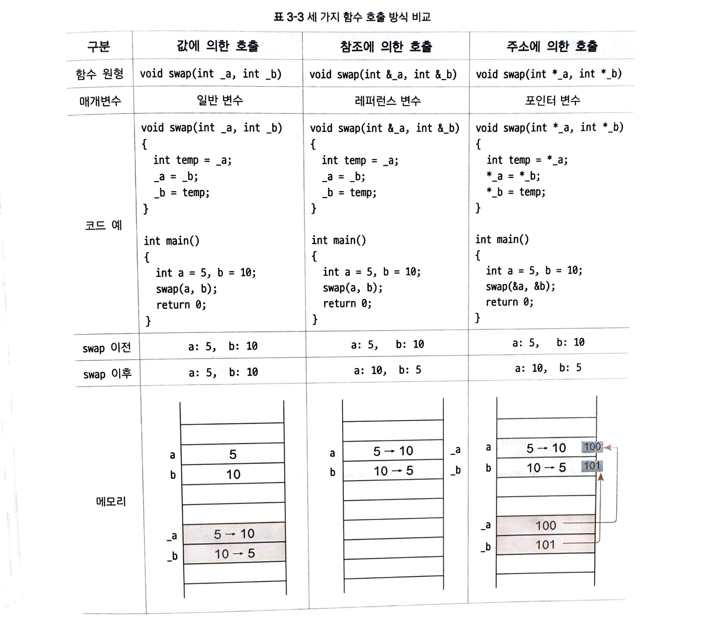

# 03-04 레퍼런스 변수
- 레퍼런스 변수의 장점을 이해하고 활용하기
- 포인터와 레퍼런스 변수의 차이를 알고 적절한 곳에서 효율적으로 사용하기.

## 레퍼런스 vs 포인터
- 레퍼런스는 포인터보다 상대적으로 개념이 간단합니다. 이해가 쉽고 잘못 사용할 가능성을 줄여 줍니다.
- 포인터를 제대로 다룰 수 있다면 최적화화 성능을 향상시킬 수 있지만, 그렇지 못하더라도 레퍼런스 덕분에 포인터의 이점을 그대로 누릴 수 있습니다.

## 레퍼런스 사용하기
C++ 언어에서 제공하는 3가지 변수 형식:
1. `일반 변수`: `값`을 저장하는 변수
2. `포인터 변수`: `메모리 주소`를 저장하는 변수
3. `레퍼런스`: 변수에 또 다른 이름, `별칭(별명)을 부여`

`또 다른 이름의 변수, 별칭`을 알아볼까요?
예제: 매개변수를 일반 변수로 선언
```cpp
#include <iostream>
using namespace std;

void swap(int a, int b)
{
    // swap 함수 내 교환 전 a, b 값
    cout << "[swap func] before swap, a: " << a << " b: " << b << endl;
    
    int temp = a;
    a = b;
    b = temp;
    
    // swap 함수 내 교환 후 a,b 값
    cout << "[swap func] after swap, a: " << a << " b: " << b << endl;   
    // 
}

int main()
{
    int a = 5;
    int b = 10;
    
    // swap 함수 호출 전 a,b 값 출력
    cout << "[main] before swap a: " << a << " b: " << b << endl << endl;
    
    swap(a,b);
    
    // swap 함수 호출 후 a, b값
    cout << endl << "[main] after swap, a: " << "  b:  " << b << endl;
    
    return 0;
}
```

실행 결과
```cpp
[main] before swap, a: 5 b:10

[swap func] before swap, a: 5  b: 10
[swap func] after swap, a: 10 b: 5

[main] after swap, a: 5 b: 10
```
- 초기 값: a = 5, b = 10
- 예상 결과: a = 10, b = 5
- 실제 결과: a = 10, b = 5 (두 값이 바뀌지 않음)

값이 바뀌지 않은 이유
- main의 a,b와 함수의 a,b 변수가 서로 다른 범위scope에 있기 때문입니다.
- 즉, 이름만 같을 뿐 메모리에서 서로 다른 공간에 저장돼 있습니다.
  - swap 함수를 호출할 때 인자로 넘긴 5,10은 swap 함수의 지역 변수인 a,b에 복사 저장되어 swap 함수에 있는 a,b 변숫값만 교환됩니다.
  - main 함수의 a,b 변숫값은 전혀 변화가 없습니다.
- 이처럼 `값을 전달하는 호출 방식`을 `값에 의한 호출 call by vall`이라고 합니다.
    - `값에 의한 호출에서는 값이 매개변수로 복사되어 함수 영역에서 새로운 변수`가 됩니다.
- 이때 레퍼런스를 이용하면 무넺를 간단하게 해결할 수 있습니다.
  - 레퍼런스 변수는 다음처럼 변수 이름 앞에 &기호로 선언합니다.
  - `자료형 &레퍼런스_변수_이름 = 대상_변수_이름`
  - &는 주소 연산자와 같은 기호지만 의미는 완전히 다릅니다.
  - `레퍼런스로 사용할 때는 메모리 주소가 아닌 원본 변수를 참조하겠다는 의미`입니다.

예제: 매개변수를 레퍼런스 변수로 선언
```cpp
#include <iostream>

void swap(int &ref_a, int &ref_a) // 매개변수를 레퍼런스 변수로 선언
{
    int temp = ref_a;
    ref_a = ref_b;
    ref_b = temp;
}

int main()
{
    int a = 5;
    int b = 10;
    
    swap(a,b);
    
    return 0;
}
```

- swap 함수의 매개변수를 int &ref_a, int &ref_b로 선언
  - main에서 swap(a,b) 함수를 호출하면 swap 함수에서는 레퍼런스 변수가 선언됩니다.
  - `main에서 넘긴 a,b 변수에 각각 별칭(또 다른 이름)이 부여`된다고 이해하면 됩니다.
  - 즉, 실제 변수는 하나지만 이름이 2개가 되는거죠. 
```cpp
int &ref_a = a; // 변수 a의 또 다른 이름 ref_a
int &ref_b = b; // 변수 b의 또 다른 이름 ref_b
```
- 이러한 `참조에 의한 호출 call by reference`이라고 합니다.
  - `참조에 의한 호출에서는 매개변수가 참조자가 되므로 피호출자(예에서는 main)의 변수를 그대로 이용`합니다.

## 레퍼런스를 사용할 때 지켜야 할 점
1. `레퍼런스 변수는 선언 후 반드시 참조할 원본 변수를 지정`해야 한다.
2. `참조할 대상이 지정된 레퍼런스 변수는 다른 변수를 참조하도록 변경할 수 없다`.
3. `레퍼런스 변수는 상수를 참조할 수 없다`. 

### 1. 레퍼런스 변수는 선언 후 반드시 참조할 원본 변수를 지정해야 한다.
올바른 레퍼런스 선언의 예:
```cpp
int value = 10;
int &ref_value = value;
```

잘못된 레퍼런스 선언의 예:
```cpp
int &ref_invalid_value; // 컴파일 오류 발생
```

### 2. 참조할 대상이 지정된 레퍼런스 변수는 다른 변수를 참조하도록 변경할 수 없다.
- 다음 코드에서는 ref_value 라는 레퍼런스 변수를 선언
  - value 변수로 초기화
  - 다시 value2 변수를 대입. 즉, value2를 참조하도록 재지정했습니다.

예제: 레퍼런스 재지정 불가
```cpp
#include <iostream>
using namespace std;

int main()
{
    int value = 10;
    int &ref_value = value;
    
    int value2 = 20;
    re_value = value2; // 레퍼런스 재지정. 의도와 다르게 동작
    
    return 0;
}
```

실행 결과
```cpp
value: 20
ref_value: 20
```
- 이미 초기화된 레퍼런스 변수에 다른 변수를 대입한다고 해서 참조가 바뀌지는 않는다.
- 실행 결과를  의도와는 다르게 value2의 값 20이 ref_value에 저장되어 value의 값이 20으로 바뀝니다.

`int &ref_value = value;`에서는 value의 다른 이름으로 ref_value를 선언하고
`ref_value = value2;` 에서는 `value = ref_value = value2`이므로 결국 `value = value2`가 되어, value에 value2의 값을 지정해요.

- 결론: 이처럼 한 번 초기화된 레퍼런스 변수는 다시 지정하지 않도록 합니다. 그래야 코드를 읽기 쉽고 의도치 않은 동작을 방지할 수 있습니다.
  - value, ref_value는 같은 메모리를 공유하는 두 이름입니다.
  - value2는 다른 메모리를 가진 별도 변수입니다.
  - ref_value = value2;는 참조 변경이 아니라 값 복사입니다.


### 3. 레퍼런스 변수는 상수를 참조할 수 없다.
- 상수: `변하지 않는 값`을 의미
- 또한 const 키워드로 지정된 변수도 상수입니다.
- 상수는 `리터럴 literal`인데, `리터럴이 있는 메모리 공간은 읽기만 가능`합니다.
  - 따라서 `해당 영역을 참조하여 값을 변경할 수 없도록 상수를 참조하는 것은 금지`되어 있습니다.

상수 참조 시도:
```cpp
int &ref_invalid_value = 50; // 컴파일 오류가 발생
```

### 추가 설명:
1. 리터럴도 메모리에 존재합니다
```cpp
int x = 42;
```
- 42는 리터럴 상수입니다.
- 이 값은 실행 중 **읽기 전용 메모리 영역 (RODATA)**에 저장됩니다.
- 즉, 리터럴도 메모리 어딘가에 실제로 존재하며 CPU는 이 주소를 읽습니다.


2. 일반 참조 (T&)는 쓰기 가능한 주소를 요구합니다. 
```cpp
int& ref = 42; // ❌ 컴파일 오류
```
- ref는 쓰기 가능한 int형 변수의 별명이어야 합니다.
- 하지만 42는 `읽기 전용 메모리`에 있으므로, 참조 후 수정하려는 가능성이 있기 때문에 허용되지 않습니다.
- 컴파일러는 오류를 발생시킵니다.

3. 상수 참조 (const T&)는 읽기만 가능하므로 허용됩니다
```cpp
const int& ref = 42; // ✅ OK
```
- ref는 값 변경을 허용하지 않는 읽기 전용 참조입니다.
- 컴파일러는 안전하다고 판단하여 리터럴 참조를 허용합니다.
- 경우에 따라, 컴파일러는 내부적으로 **임시 변수(temp)**를 만들어서 참조를 연결합니다

| 표현                     | 결과       | 이유                      |
| ---------------------- | -------- | ----------------------- |
| `int& ref = 42;`       | ❌ 컴파일 오류 | 쓰기 가능 참조는 읽기 전용 메모리에 불가 |
| `const int& ref = 42;` | ✅ 정상 작동  | 읽기 전용 참조이므로 안전하게 허용됨    |

🔐 비유로 이해하기
- `int& ref = 42;`
    → 🔧 금고를 드라이버로 열려고 시도 → 실패 (금고는 잠겨 있음)

- `const int& ref = 42;` → 👀 금고를 구경만 하겠다고 약속 → 허용

## 문법 요약: 레퍼런스 변수
- 레퍼런스는 `기존 변수의 별칭(alias)`이다.
- 기존 변수에 별칭을 부여하여 `해당 변수를 가리킨다`.
- 레퍼런스 변수를 수정하면 `원본 변수도 함께 변경`된다.
- `함수의 매개변수`로 사용하면 `원본 데이터를 복사하지 않고도 수정`할 수 있다.

```cpp
//매개변수를 레퍼런스 변수로 선언
void increment(int &num)
{
    num++; // 원본 변수도 함께 변경됨
}

int main()
{
    int value = 5;
    increment(value); // 함수 호출로 value 증가
    
    std::cout << "Updated value: " << value << std::endl;
    return 0;
}
```

## 세 가지 함수 호출 방식
1. `값에 의한 호출` (call by value)
2. `참조에 의한 호출` (call by reference): 레퍼런스
3. `주소에 의한 호출` (call by address): 포인터



## 레퍼런스와 포인터는 어떤 차이가 있나요?
- 사실 레퍼런스의 기능은 포인터로도 할 수 있습니다.
- 질문: 그런데도 C++ 언어는 왜 굳이 레퍼런스를 제공할까요?
  - `포인터는 강력하지만 능숙하게 다루기가 어렵기 때문`입니다.
  - 특히 현업에서 규모가 큰 프로젝트를 진행할 때는 여러 개발자들의 협업이 필요한데, 이때 포인터를 다루다가 문제가 발생할 수 있습니다.
- 결국 `레퍼런스는 포인터를 비교적 안전하게 이용할 수 있도록 만든 도구라고 생각`할 수 있습니다.
  - 포인터처럼 `원본 값에 접근할 수는 있지만`
  - `원본 자체나 공간의 크기, 메모리 주소 등은 변경하지 못하게 막은 것`으로 볼 수 있습니다.
  - 책 후반부에서 소개할 모던 `C++의 스마트 포인터`도 같은 맥락에서 등장한 개념입니다.
    - `메모리가 누수되 않도록 프로그램의 안정성을 보장하는 데 유용하게 사용`할 수 있습니다.

## 3분 퀴즈
- 질문 1: 레퍼런스 변수의 정의를 서술해 보세요.
- 답변 1: `변수의 또 다름 이름입니다. 별칭(별명) 변수.`

- 질문 2: 다음 코드에 이어 value를 참조하는 레퍼런스 변수를 만들어 보세요
```cpp
int value = 10; 
```
- 답변 2:
```cpp
int value = 10;
int &value_reference = value; 
```

- 질문 3: 참조에 의한 호출 방식의 swap 함수 원형을 선언해 보세요.
- 답변 3: `void swap(int &_a, int &_b);`


