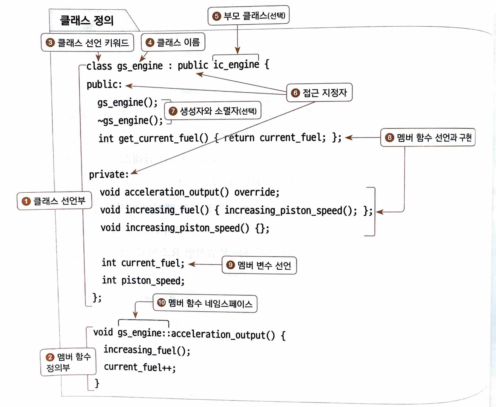

# 06-03: class와 instance
- 객체지향 프로그래밍 클래스의 개념을 이해하기
- C++ 클래스와 인스턴스를 선언하는 문법 이해하기

## 클래스란 무엇일까요?

> 객체지향 프로그래밍은 <br>
데이터와 함수로 포함하는 객체를 활용하는 프로그래밍 패러다임이며 <br>
다양한 객체 간에 관계를 소스 코드로 구성하여 프로그램을 완성한다.

- `객체 object`: 데이터와 함수를 포함하는 논리 단위
  - 객체를 `클래스 class`라고도 합니다.
  - **클래스는 객체가 포함하는 데이터와 함수를 정의하는 문법적인 요소이고, 객체는 특정 클래스를 사용할 수 있도록 만든 변수**입니다. 

- 클래스를 정의할 때: `객체가 가질 테이터와 함수를 작성`합니다. 
  - `멤버 변수`: 클래스가 포함하는 데이터를 의미한다. 멤버 변수는 클래스의 속성을 나타낸다.
  - `멤버 함수`: 클래스가 포함하는 함수를 의미한다. 멤버 함수는 클래스의 행동을 나타낸다.
    - `생성자`와 `소멸자`라는 특별한 함수도 포함할 수 있습니다.
    - 생성자는 객체가 생성될 때, 소멸자는 객체가 소멸할 때 자동으로 호출되는 함수입니다.
  - 멤버 변수와 멤버 함수는 정의할 때는 `public`, `private` 같은 접근 지정자가 필요합니다.
    - 접근 지정는 접근 범위를 통제하는 역할을 합니다. 

## 클래스 정의 문법
- 클래스를 정의하는 문법을 보면 크게 `클래스 선언부`와 `멤버 함수 정의부`로 나눌 수 있습니다.
  - **클래스 선언부**: 멤버 변수, 멤버 함수, 생성자, 소멸자
  - **멤버 함수 정의부**: 멤버 함수 정의 

```cpp
// class: 클래스 선언 키워드
// gs_engine: 클래스 이름
// public, private: 접근 지정자
// ic_engine: 부모 클래스 (선택 사항)
// class {...} 클래스 선언부

class gs_engine : public ic_engine {
    public:             // 접근 지정자
        gs_engine();    // 생성자(선택)
        ~gs_engine();   // 소멸자(선택)
        int get_current_fule() { return current_fuel; } // 멤버 함수 선언과 구현
        
    private:
        // 멤버 함수 선언과 구현
        void acceleration_output() override;
        void increasing_fuel() { increasing_piston_speed(); };
        void increasing_piston_speed() {};
        
        int current_fuel;
        int piston_speed;
    };
    
    // gs_engine::acceleration_ouput 으로 멤버 함수 네임스페이스
    // 멤버 함수 정의부
    void gs_engine::acceleration_out() {
        increasing_fuel();
        current_fuel++;
    }
```



1. `클래스 선언부`: 클래스를 선언하는 부분입니다. 멤버 함수 정의를 제외한 클래스와 관련된 모든 것을 이곳에서 선언합니다.
2. `멤버 함수 정의부`: 클래스에 선언한 멤버 함수를 정의합니다.
3. `클래스 선언 키워드`: 클래스를 선언하는 class 키워드입니다.
4. `클래스 이름`: 클래스를 나타내는 이름입니다.
   - 이 클래스의 객체를 만들 때 사용하는 `데이터 형식`으로 볼 수 있습니다.
5. `부모 클래스(선택)`: 클래스가 다른 클래스를 상속받을 때 쌍점(:) 다음에 접근 지정자와 부모 클래스를 지정합니다. 상속받지 않으면 생략합니다.
6. `접근 지정자`(private, public): 멤버 변수와 함수가 외부에서 접근할 수 있는지를 표시합니다. 
   - 접근 지정자 다음에 나오는 멤버 변수와 함수는 해당 접근 제어 설정에 따릅니다.
7. `생성자와 소멸자`(선택): 객체가 생성되거나 소멸할 때 호출되는 함수입니다.
   - 선택적으로 사용할 수 있습니다.
8. `멤버 함수 선언과 정의`: 객체에 포함할 멤버 함수를 선언합니다. 
   - 간단한 함수는 클래스 선언부에서 중괄호 {}를 이용해 정의하기도 합니다.
9. `멤버 변수 선언`: 객체에 포함할 멤버 변수를 선언합니다.
10. `멤버 함수 네임스페이스`: 멤버 함수 정의부에서는 해당 함수가 어떤 클래스에 속하는지 알 수 있도록 클래스 이름을 네임스페이스로 사용합니다. 

## 객체 선언
- 정의한 클래스를 사용하려면 `객체`를 선언해야 합니다.
- 클래스의 객체를 선언하는 방법은 데이터 형식으로 변수를 선언하는 것과 같습니다.
  - 1) 클래스를 데이터 형식으로 삼고 객체를 선언하는 방법
  - 2) `new 키워드를 사용하여 동적으로 메모리를 할당하는 방법`
    - `new` 키워드로 동적 메모미를 할당한 경우에는 반드시 `delete` 키워드로 메모리를 해제해 주어야 합니다.

클래스 객체 선언 방법
```cpp
// 클래스 정의
class engine {... (생략) ... };

// 클래스를 데이터 형식처럼 사용하는 방법
engine my_engine;

// 클래스 형식으로 동적 메모리 할당과 해제 방법
engine *my_engine_pointer = new engine();
delete my_engine_pointer;
```
- 객체에 만들었으면 비로소 클래스의 멤버를 사용할 수 있습니다.
  - 클래스의 멤버를 사용할 때는 다음처럼 객체 이름에 멤버 접근 연산자 점(.)을 사용합니다.

```cpp
my_engine.current_fuel; // 멤버 변수에 접근
my_engine.increasing_pistion_speed(); // 멤버 함수 호출
```

## 3분 퀴즈
- 질문 1: 클래스란 무엇일까요? 정의해 보세요.
- 답변 1: `클래스는 객체가 포함하는 데이터와 함수를 정의하는 문법적인 요소입니다`.

- 질문 2: 객체와 클래스의 차이를 설명해 보세요. 그리고 객체와 클래스는 몇 대 몇 관계일까요?
- 답변 2:

**클래스(class)란?**
- **정의**: 객체를 만들기 위한 설계도 또는 청사진입니다.
- **포함내용**: 데이터(속상, 변수)와 동작(메서드, 함수)의 정의가 들어 있습니다.
- 예시:
```cpp
class Car:
    def __init__(self, color):
        self.color = color
    def drive(self):
        print(f"{self.color} 차가 달립니다.")
```
여기서 `Car`는 클래스입니다.

**객체(Object)란?**
- 정의: 클래스를 기반으로 **실제로 만들어진 실체(instance)**입니다.
- 특징: 메모리 공간을 차지하고, 클래스로 정의된 속성과 메서드를 사용할 수 있습니다.
- 예시:
```cpp
my_car = Car("빨간색")
my_car.drive() # 출력: 빨간색 차가 달립니다.  
```
여기서 `my_car`는 `Car` 클래스의 객체입니다.


- **객체와 클래스의 관계는?**
- 관계: **"클래스 : 객체 = 1 : N"** 관계입니다.
  - 하나의 클래스로 **여러 개의 객체**를 만들 수 있습니다.
  - 반대로, 하나의 객체는 반드시 하나의 클래스에만 속합니다.

예시:
```cpp
car1 = Car("검정색")
car2 = Car("하얀색")
car3 = Car("노란색")
```
위 예제에서 `Car`라는 **하나의 클래스**로부터 
`car1`, `car2`, `car3`이라는 **세 개의 객체**가 생성되었습니다.


