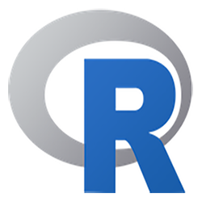

  
  
  
  
  
  
  
  
  

  <em>Programming language logos used under fair use from <a href="https://github.com/bablubambal/All_logo_and_pictures/tree/main/others">this GitHub repository</a>.</em>

## 🛠 Languages Covered

### Core Languages & Use Cases:
- **C/C++** – systems-level programming, performance optimization
- **C#** – console applications, OOP exercises, .NET development  
- **Java** – language fundamentals, algorithms, object-oriented design
- **JavaScript** – DOM manipulation, dynamic content, browser scripting  
- **Python** – scripting, data analysis, machine learning prototypes  
- **R** – statistical computing, data visualization, R Markdown reporting  
- **SQL** – relational data modeling, query design, real-world datasets  

### Additional Tools:

- **JSON** – lightweight data exchange format used across APIs and configs  

---